# Peasant architecture

This page shows how the parts of Peasant connect. It goes from the high level to the low level:

1. [System context](#system-context): Peasant, its user, and the systems it talks to.
2. [Containers](#containers): the runtime units and data stores inside Peasant.
3. [Components](#components): the Go packages and the web modules inside each container.
4. [Deployment](#deployment): where each container runs on the developer workstation.
5. [Dynamic views](#dynamic-views): the main flows between containers, in numbered order.
6. [Call sequences](#call-sequences): the same flows at the level of functions and files.
7. [Package map](#package-map): the role of each package under `internal/` and `cmd/`.

All diagrams are Mermaid, so GitHub renders them in place. The structural views follow the C4
model vocabulary of [`.claude/skills/c4-model`](../.claude/skills/c4-model/SKILL.md) and
are drawn as Mermaid flowcharts: each box names its element, its C4 type in square brackets,
and a short description, and a dashed outline marks a boundary. Every arrow is one relationship,
read as "source, label (technology), target". The dynamic views and the call sequences are
Mermaid sequence diagrams. Colors follow the C4 convention: dark blue for people, blue for
Peasant's own elements, and grey for external systems.

The libraries `github.com/peasant-labs/schema`, `github.com/peasant-labs/redact`, and
`@peasant-labs/fairtrade` are not containers. They show as technology text or in the package
map, never as boxes.

Provenance: derived from the source tree on this branch. The main sources are `cmd/peasant`,
`internal/ingest/pipeline.go`, `internal/ingest/adapter.go`, `internal/api/server.go`,
`internal/push/pipeline.go`, `internal/pull/pipeline.go`, `internal/auth`,
`internal/githooks`, `internal/defaults`, `embed.go`, and `web/src`. When the code and a
diagram disagree, the diagram is wrong. Re-derive the tables from the source before you redraw.

## System context

Peasant is local-first. It reads the session stores of AI coding harnesses on the developer's
machine, keeps its own copy and index, and shows the sessions in a local web app. It sends data
off the machine only when the developer publishes, pulls, logs in, syncs model prices, or
upgrades. There is no telemetry and no background upload. The git hook upload runs only after
the developer installs the hook with `peasant village hooks install`.

Elements:

| Name | Type | Description |
|---|---|---|
| developer | Person | Works with AI coding agents and reviews the sessions. |
| peasant | Software System | Harvests, indexes, shows, and publishes agent sessions. |
| agent session stores | Software System, external | Claude Code, Codex, Cursor, OpenCode, Pi, and Strike stores. |
| git repository | Software System, external | The project repository of the developer. |
| village | Software System, external | Registry and commons for published transcripts. |
| models.dev | Software System, external | Public catalog of model prices and limits. |
| GitHub Releases | Software System, external | Hosts the peasant release archives. |

Relationships:

| Source | Target | Intent | Technology | Trigger |
|---|---|---|---|---|
| developer | peasant | runs commands and opens the local web app | terminal, browser | user |
| peasant | agent session stores | reads sessions | JSONL, SQLite | `harvest`, `kickstart`, web ingest |
| peasant | git repository | reads commits, sets hooks | git CLI | `harvest --detect-commits`, `village hooks` |
| git repository | peasant | runs the upload hook | shell | only after `village hooks install` |
| peasant | village | publishes and pulls | HTTPS | `village push`, `/share`, `village transcripts pull` |
| peasant | models.dev | syncs model prices | HTTPS | `peasant models sync` |
| peasant | GitHub Releases | downloads upgrades | HTTPS | `peasant upgrade` |

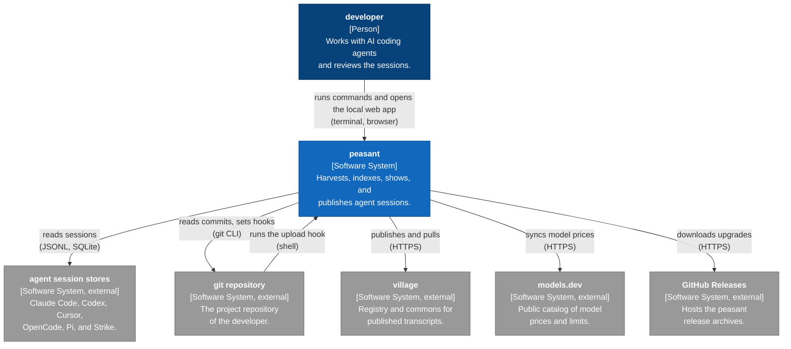

## Containers

Peasant ships as one static Go binary. The same binary runs the CLI commands and, under
`peasant web start`, the local HTTP server. The web app is a Next.js static export that the
binary embeds with `//go:embed all:web/out` in `embed.go` and serves on port 8690.

Harvest stores transcripts as recorded. It does not redact them. Redaction runs on the way
out: in the `/share` scan, in `peasant village push`, and in `peasant export`.

Elements:

| Name | Type | Technology | Description |
|---|---|---|---|
| peasant web app | Container | Next.js 15, React 19 | Static SPA. Renders transcripts with fairtrade. Hosts `/share`. |
| peasant binary | Container | Go, Cobra, net/http | CLI commands and, under `web start`, REST, WebSocket, and the SPA. |
| analytics database | Container | SQLite | `peasant.db`: sessions, entries, commits, annotations, publications, pulls. |
| sync tree | Container | JSONL files | `peasant-sync/` transcript copies and `village-pulls/` downloads. |
| settings files | Container | YAML, JSON | `config.yaml` (selection, publication defaults) and `credentials.json`. |

Relationships:

| Source | Target | Intent | Technology |
|---|---|---|---|
| developer | peasant web app | opens localhost:8690 | browser |
| developer | peasant binary | runs peasant commands | terminal |
| peasant web app | peasant binary | calls the API | HTTP REST, WebSocket `/api/v1/ws` |
| peasant binary | analytics database | reads and writes | SQL, `zombiezen.com/go/sqlite` |
| peasant binary | sync tree | writes and reads | files |
| peasant binary | settings files | reads and writes | YAML, JSON |
| peasant binary | agent session stores | reads session files and rows | JSONL, SQLite |
| peasant binary | git repository | reads the log and sets hooks | git CLI |
| peasant binary | village | publishes and pulls | HTTPS, JSON, multipart |

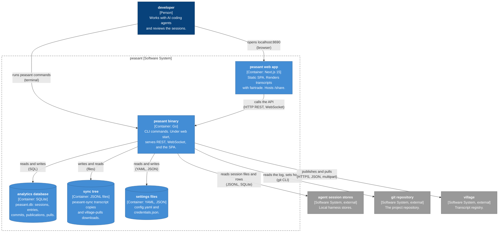

## Components

### Harvest path

`peasant harvest` (alias `peasant ingest`) builds one `ingest.Pipeline` and runs it. The
pipeline asks one adapter per enabled harness to discover sessions, writes a copy of each
changed transcript to the sync tree, mirrors the session rows into SQLite, and then indexes the
transcript into `session_entries`. Each harness declares its record kinds in
`internal/ingest/*_vocabulary.go`. The indexer maps each kind to an `indexformat.Outcome`, and
one central lowering in `record_kinds_lowering.go` decides the stored entry shape.

| Component | Package | Description |
|---|---|---|
| cli | `cmd/peasant` | Cobra command tree. `runHarvest` builds the pipeline options. |
| config | `internal/config` | Loads `config.yaml` and compiles the `SelectionMatcher`. |
| ingest pipeline | `internal/ingest` | Stages DISCOVER to AUDIT. Owns write, mirror, and index. |
| harness adapters | `internal/ingest` | `SourceAdapter`, `TranscriptIndexer`, and vocabulary per harness. |
| store | `internal/store` | SQLite schema, migrations, readers, and writers. |

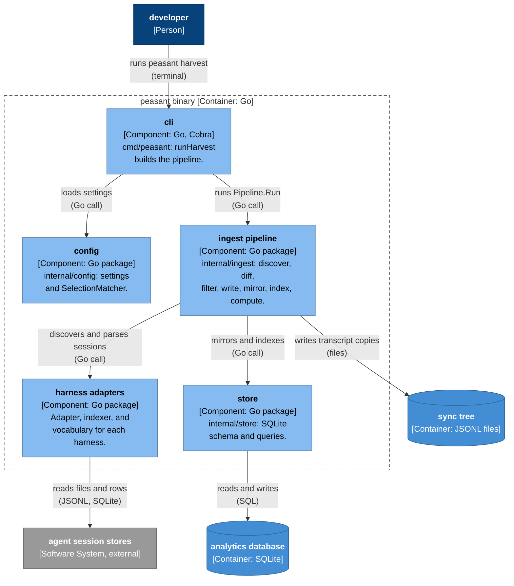

### Serve and publish path

`peasant web start` wires `internal/api` over the store. The WebSocket hub pushes session lists
and session detail. The REST routes serve lists, the code map, review, annotations, and the
`/share` sync endpoints. The sync handler runs the same `push.Pipeline` as
`peasant village push`.

| Component | Package | Description |
|---|---|---|
| api | `internal/api` | `Server`, `Hub`, `StoreDataProvider`, `spaHandler`, sync handler. |
| transcript | `internal/transcript` | `EntriesToTurns`, `SessionToDetail`, snapshot detail builders. |
| push | `internal/push` | Target selection, preflight, re-redaction, mapping, upload, receipts. |
| village client | `internal/village` | Village HTTP client for publish, pull, and schema negotiation. |
| auth | `internal/auth` | Loopback OAuth login and `credentials.json`. |
| store | `internal/store` | Same component as on the harvest path. |

The canonical detail path is `store` entries, then `transcript.EntriesToTurns`, then
`transcript.SessionToDetail`. `api.EntriesToTurns` and `api.SessionToDetail` are thin wrappers
over it. Sessions indexed into a managed generation take the snapshot branch,
`transcript.BuildSnapshotDetailBytes`, which produces the same `SessionDetailPayload`.

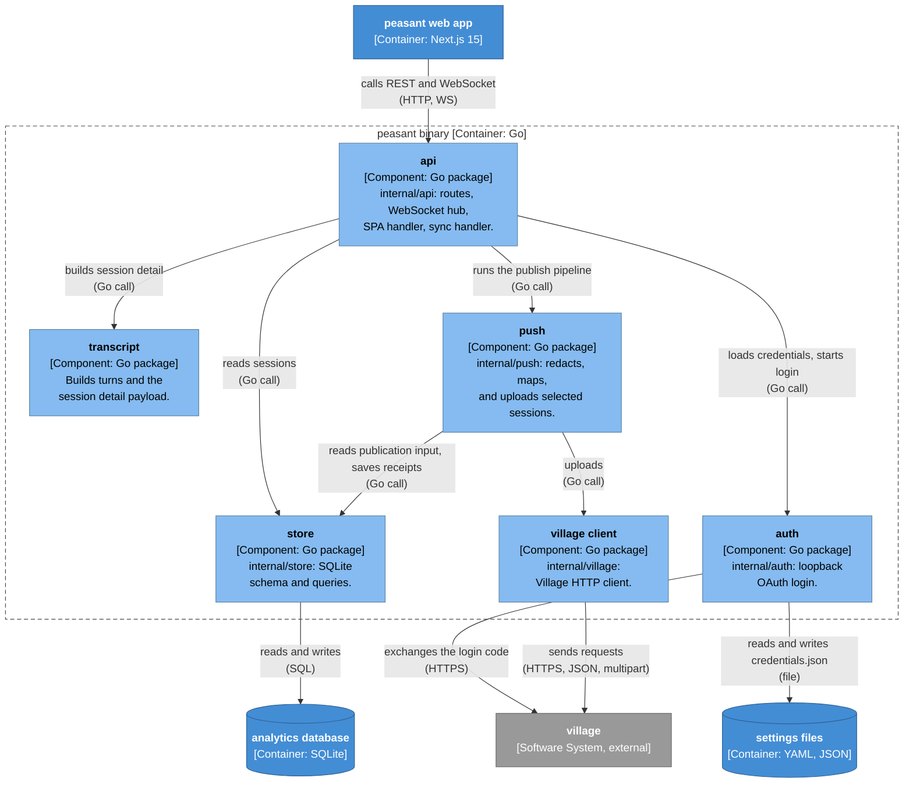

### Web app

The SPA opens one WebSocket and keeps topic data in a channel store. Pages read lists and
session detail from that store and call REST helpers for the rest. Transcript rendering comes
from `@peasant-labs/fairtrade/ui` and `/graph`. Peasant only adapts local data to it.

| Route | Main file | Data |
|---|---|---|
| `/` | `web/src/app/page.tsx` | WS `sessions`, REST project summaries |
| `/projects/...` | `web/src/app/projects/` | WS `session_detail`, rendered by `SessionDetailV2` |
| `/share` | `web/src/app/share/` | REST `/api/v1/sync/*` |
| `/review/...` | `web/src/app/review/` | REST `/api/v1/review/*` |
| `/map/...` | `web/src/app/map/` | REST `/api/v1/map/*`, capability gated |
| `/analytics` | `web/src/app/analytics/` | WS `quality`, rendered by fairtrade analytics |

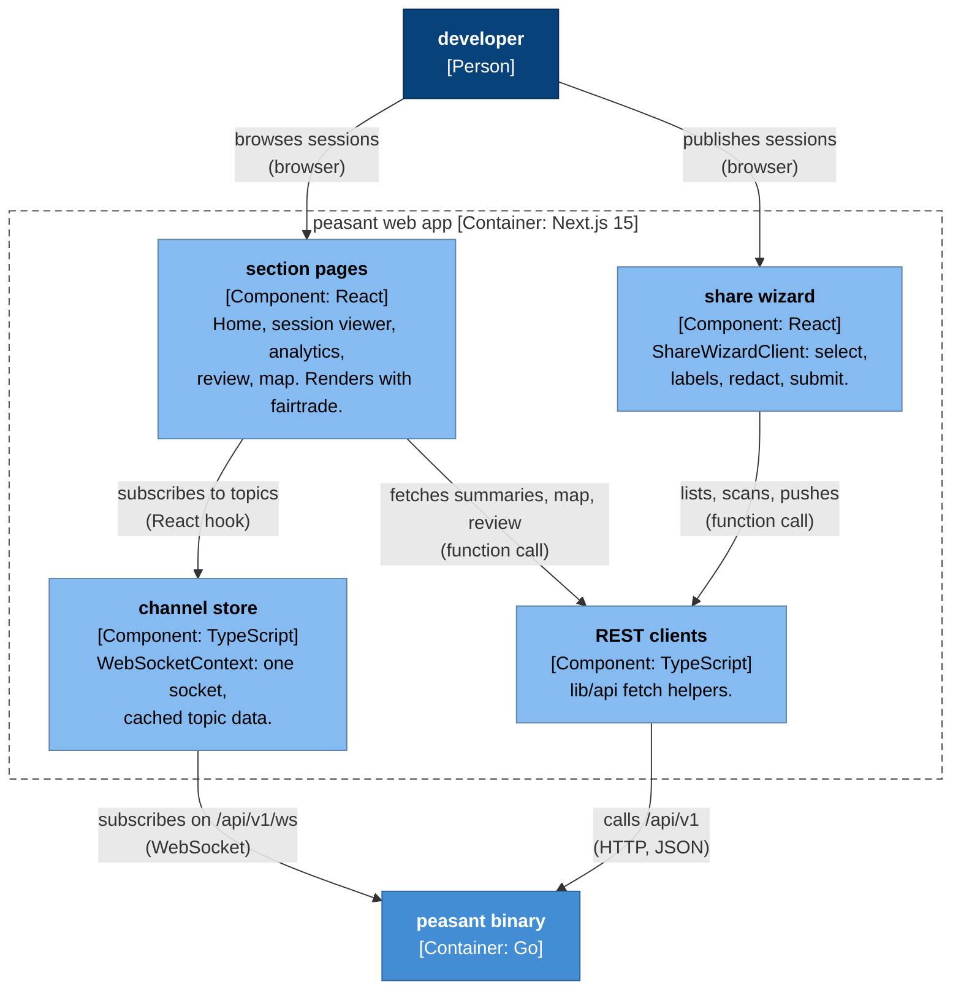

## Deployment

Everything runs on the developer workstation. Paths follow XDG: the data dir is
`$XDG_DATA_HOME/peasant` (default `~/.local/share/peasant`), and the config dir is
`$XDG_CONFIG_HOME/peasant` (default `~/.config/peasant`). The `--data-dir` and `--config-dir`
flags override them.

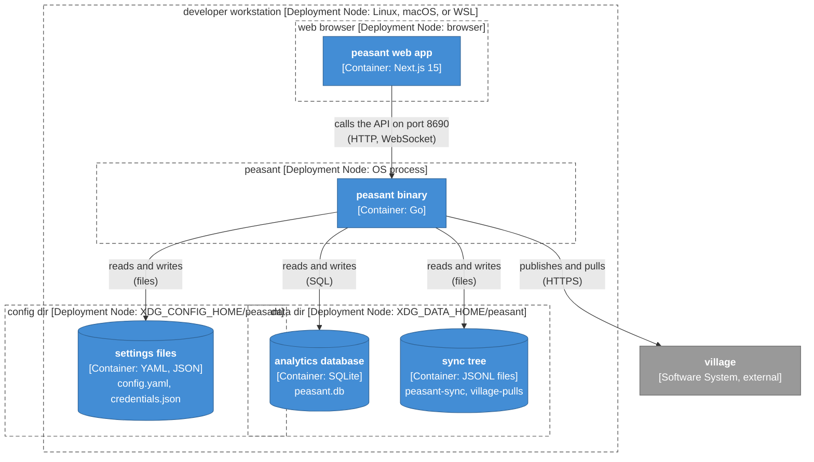

## Dynamic views

### Harvest local agent sessions

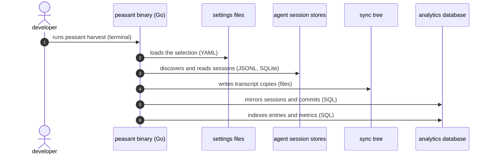

### Open a session in the local web app

`peasant web start` forks a `--foreground` child that runs the server, waits for
`/api/v1/health`, and opens the browser. `--no-browser` skips step 2.

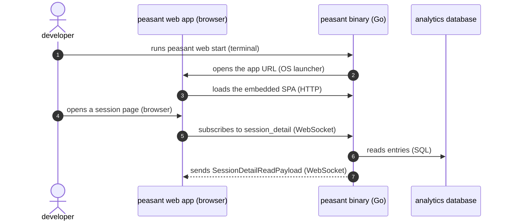

### Publish sessions with /share

The wizard steps are select, labels, redact, and submit. The scan result is cached per
`(level, session)`. The push refuses a session whose capture is not ready for publication, for
example a bounded preview. A capture whose only gap is an over-limit record with a placeholder
entry is ready and publishes with `diagnostics.partial` set.

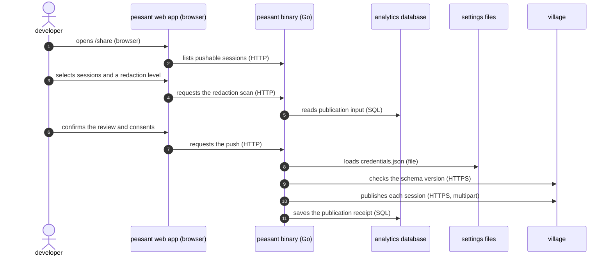

### Upload from a git hook

The hook exists only after `peasant village hooks install --event post-commit` or
`--event pre-push`. The hook always exits 0, so a Village failure never blocks git.

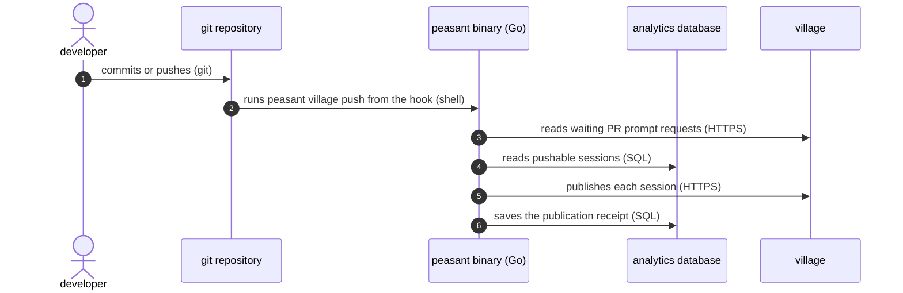

### Log in to Village

Village runs the GitHub sign-in in the browser. Peasant never calls the GitHub API for login.
Steps 2 and 3 happen in the developer's browser.

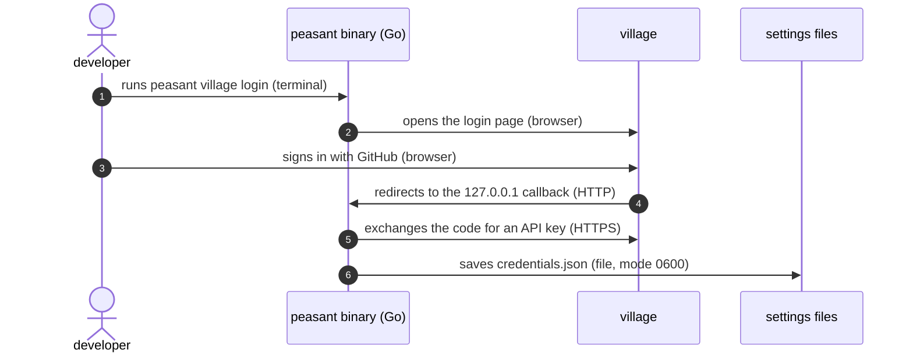

## Call sequences

Solid arrows are calls. Dashed arrows are returns. An arrow from a participant to itself is a
step inside that participant. A note across all participants names a pipeline stage.

### Harvest pipeline

Entry: `cmd/peasant/cmd_harvest.go`. Pipeline: `internal/ingest/pipeline.go`. The durability
point is the SQLite commit, not the file write. A record over `defaults.MaxJSONLRecordBytes`
(256 MiB) becomes a stand-in line before the write and a placeholder entry at index time.

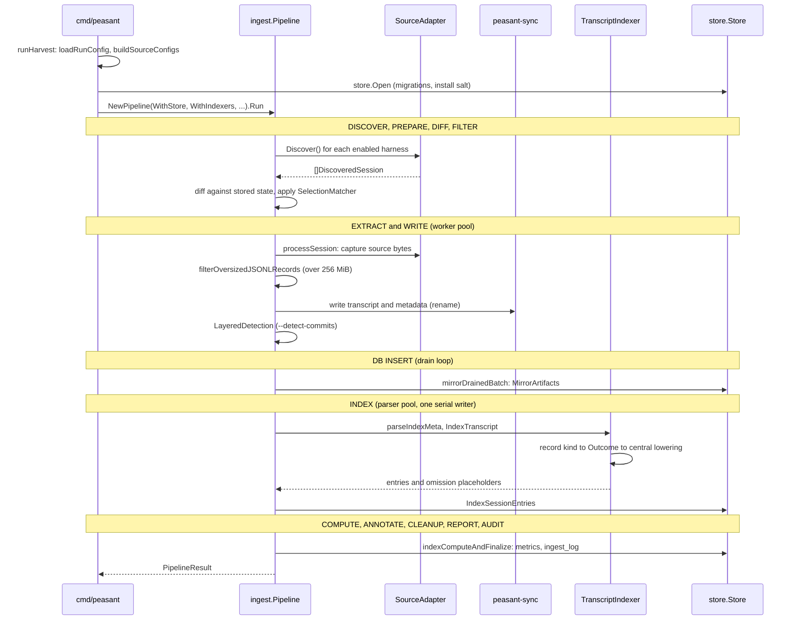

### Local server start

Entry: `cmd/peasant/cmd_web.go`. Server: `internal/api/server.go`.

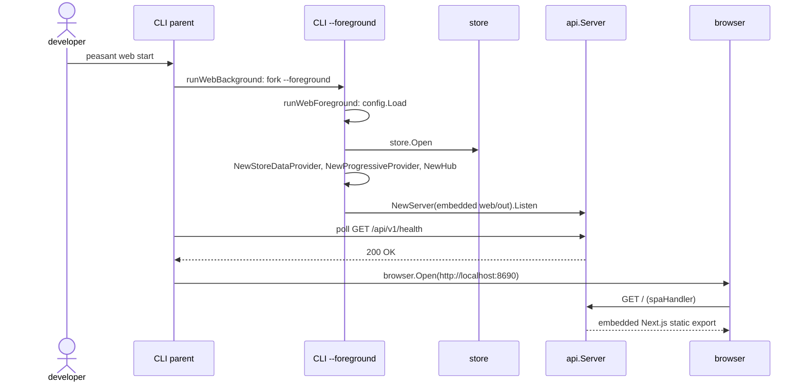

### Session detail over WebSocket

Client: `web/src/contexts/WebSocketContext.tsx`. Server: `internal/api/websocket.go`,
`internal/api/detail_navigation.go`, `internal/api/snapshot_detail.go`.

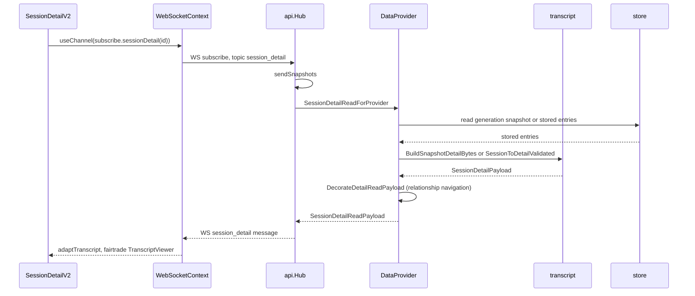

### /share scan and publish

Client: `web/src/app/share/`. Server: `internal/api/sync_handler.go`, `internal/push/`,
`internal/village/`.

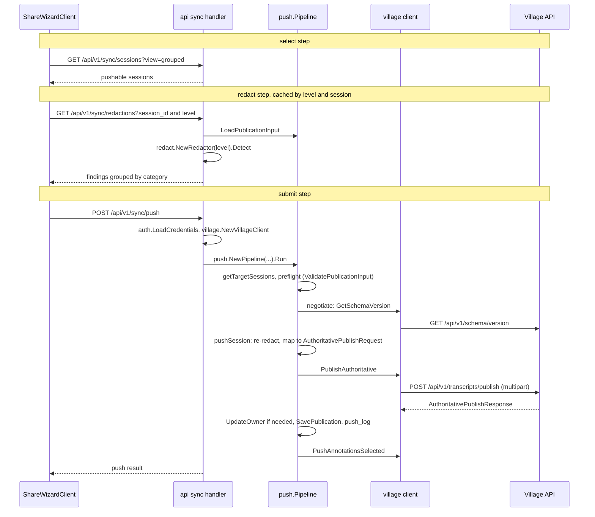

### Village login

`internal/auth/login.go` and `internal/auth/server.go`. The callback port is
`defaults.LoginCallbackPort` (17249) and falls back to an ephemeral port.

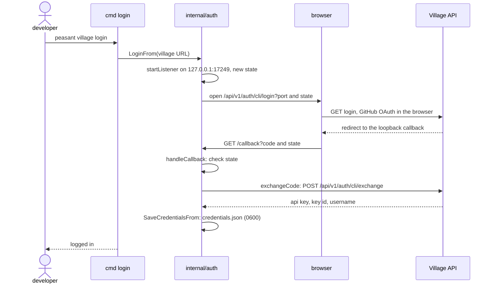

### Git hook upload

`internal/githooks/script.go` renders the hook command. `cmd/peasant/cmd_push.go` runs it.

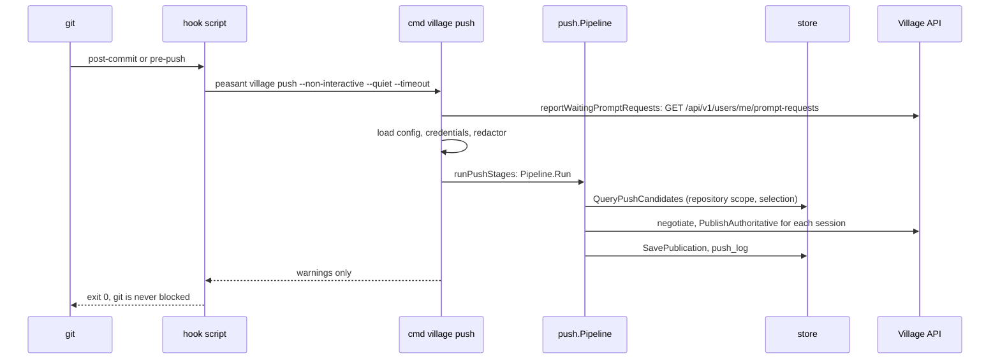

### Pull a transcript

`internal/pull/pipeline.go`. Pulled transcripts go to their own tables and never enter
`sessions`, so they are never push candidates.

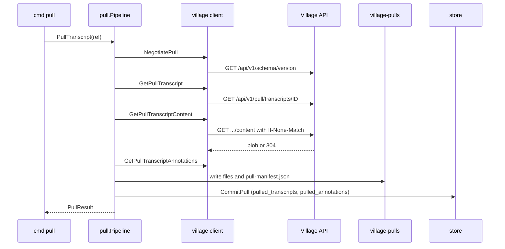

### Kickstart

`cmd/peasant/cmd_kickstart.go` and `internal/tui/kickstart`. The single `Draft.Commit` is the
only write of `config.SelectionConfig`. Kickstart never publishes.

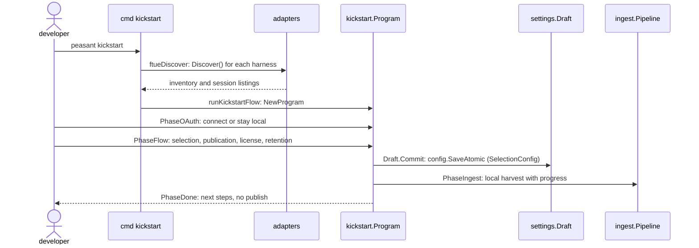

## Package map

| Package | Role | Main callers |
|---|---|---|
| `cmd/peasant` | Cobra command tree: `harvest`, `web`, `kickstart`, `config`, `village`, `export`, `prune`, `sessions`, `annotate`, `metrics`, `models`, `upgrade`. | user, git hooks |
| `internal/ingest` | Discovery, write, mirror, index pipeline. Adapters, indexers, vocabularies, `SelectionMatcher`. | `harvest`, `kickstart`, api sync ingest |
| `internal/indexformat` | Outcome IR and index result versions. | ingest, store |
| `internal/store` | SQLite schema, migrations, readers, writers. | nearly every command |
| `internal/transcript` | Stored entries to turns to `SessionDetailPayload`. | api, export, tui |
| `internal/api` | HTTP server, WebSocket hub, data providers, sync handler. | `web start`, `tui` |
| `internal/push` | Publication pipeline and the push wizard. | `village push`, api sync handler |
| `internal/pull` | Pull pipeline for Village transcripts and annotations. | `village transcripts pull` |
| `internal/village` | Village HTTP client. | push, pull, api |
| `internal/auth` | Loopback OAuth login, `credentials.json`. | `village login`, api sync handler |
| `internal/githooks` | Installs, checks, and removes the upload hooks. | `village hooks` |
| `internal/gitops` | Read-only git for the code map and review. | codemap |
| `internal/codemap`, `internal/codegraph` | Code map and change review graphs. | api map and review routes |
| `internal/config` | Settings, selection, redaction policy. | CLI, api, push |
| `internal/defaults` | Paths, ports, limits, shared constants. | everywhere |
| `internal/sessionvisibility`, `internal/selectionprojection` | Scope lists and pickers to the selection. The scope is not access control. | api, kickstart |
| `internal/export` | Redacted session and annotation export. | `peasant export` |
| `internal/annotations` | Annotation type registry and validation. | api, `annotate` |
| `internal/metrics` | Session metrics and classifiers. | ingest, `metrics` |
| `internal/sessionorigin`, `internal/salt`, `internal/title`, `internal/projectlabel`, `internal/codexstate` | Origin labels, install salt, title redaction, project labels, Codex rollout pointer. | ingest, store, push |
| `internal/tui` and subpackages | Kickstart, config editor, harvest progress, push wizard, layout kit. | `kickstart`, `config`, `harvest`, `village push` |
| `internal/mock`, `internal/redactmock` | Mock data provider and generated mock redactions. | `web start`, `cmd/gen-mock-redactions` |
| `cmd/gen-*`, `cmd/peasant-guided-screenshots`, `cmd/peasant-origin-audit` | Code generators and opt-in audit tools. | developers |
