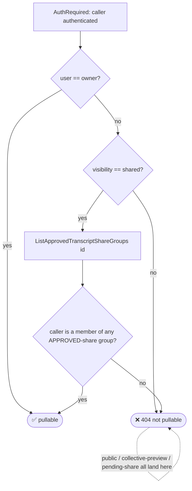

# Peasant ↔ Village Auth Model

> The **whole** authentication and authorization model between the peasant CLI and
> the village server: identity & credentials, wire auth, command gates, the
> authorization matrices (web vs pull), allowed/denied case tables, and the future
> seams. This is the **canonical** auth doc; the village backend points here (see
> village `README.md` and the doc comment on `canPullTranscript`). Companion:
> [Village Pull Architecture](pull.md).
>
> **Policy.** The visibility/pull model uses a deliberate two-tier gate: commands
> that contact the village require login, while local reads stay offline. The
> divergences from web viewing are intentional, not incidental.

---

## 1. Identity & credentials

| Concern | Mechanism | Source |
|---------|-----------|--------|
| Login | **loopback OAuth** browser flow: peasant starts a local callback server on an ephemeral port, opens the browser to `…/api/v1/auth/cli/login?port=&state=`, waits for the redirect with credentials | `internal/auth/login.go` (`Login`) |
| Stored credentials | `credentials.json` in the config dir, written **`0600`** (`PrivateFilePerm`) | `internal/auth/credentials.go` (`SaveCredentials`) |
| Credential fields | `api_key`, `key_id`, `user_id`, `username`, `village_url`, `linked_at` | `auth.Credentials` |
| Validity | `IsValid()` = all of api_key/key_id/user_id/username present | `credentials.go` |
| Logout / key revocation | `Logout` sends `DELETE /api/v1/auth/api-keys/{key_id}` (Bearer apiKey) to the village, then **always** clears local `credentials.json` — even if remote revocation fails | `internal/auth/logout.go`; village `RevokeAPIKey` (`handler/auth.go`) |

The CLI never persists a long-lived OAuth token — the browser flow exchanges to a
village-minted **API key** that is the only credential stored on disk.

---

## 2. Wire auth

Every village-contacting request carries `Authorization: Bearer <apiKey>`
(`internal/village` `newAuthedGet`, and the pull GETs / push). The village's
`authenticate` middleware resolves the caller through a **chain**:

```
1. Cookie (auth.CookieName)  → ValidateToken(JWT) ─┐
2. Authorization: Bearer …                          ├─► AuthUser{ID, Username}
   2a. API key  (IsAPIKey → HashAPIKey → GetAPIKeyByHash, async TouchLastUsed)
   2b. JWT bearer (ValidateToken)                  ─┘
   (no/!Bearer header → nil, unauthenticated)
```

- `AuthRequired` middleware: unauthenticated → **401** (`"Authentication
  required"`); else injects `AuthUser` into the request context.
- `AuthOptional` middleware: attaches `AuthUser` when present, otherwise proceeds
  anonymously (used by the web read endpoints).
- API keys are stored **hashed** (`HashAPIKey` = SHA-256 hex); the plaintext key
  exists only on the CLI. `IsAPIKey` gates on the `APIKeyPrefix`.

Source: village `backend/internal/handler/auth_middleware.go`,
`backend/internal/auth/apikey.go`.

---

## 3. Command gates (peasant CLI)

The pull surface uses a **two-tier** gate: commands that **contact the village**
require login; purely-local reads are **offline**.

| Command | Contacts village? | Gate | Source |
|---------|-------------------|------|--------|
| `village transcripts pull <ref>` | yes | **login required** — `requireVillageCredentials` (mirrors `cmd_push.go`) | `cmd_village_pull.go` |
| `village transcripts list` (remote, default) | yes | **login required** | `cmd_village_list.go` |
| `village annotations sync` | yes | **login required** | `cmd_village_annotations.go` |
| `village transcripts list --local` | **no** | **OFFLINE** — no credentials loaded | `cmd_village_list.go` (`runVillageTranscriptsListLocal`) |
| `village transcripts context <ref>` | **no** | **OFFLINE** — reads only the V34 index + on-disk blob | `cmd_village_transcripts.go` |
| `village push` (existing) | yes | login required + public-consent | `cmd_push.go` |

`requireVillageCredentials` fails fast logged-out with an **actionable** error
naming `peasant village login`, and separately rejects a missing `village_url`.
Purely-local commands **must not** call it.

**Usage-dump silenced on runtime errors.** Each village RunE sets
`cmd.SilenceUsage = true` so a runtime error (auth gate, unreachable village,
pipeline failure) prints the actionable one-liner **alone** — cobra's Usage/Flags
block is suppressed for runtime errors, but retained for argument and flag errors.

Tested by `TestVillageAuthMatrix_LoggedOut` / `TestVillageAuthMatrix_LoggedIn`
(`cmd/peasant/cmd_village_transcripts_test.go`).

---

## 4. Authorization matrices — web vs pull

The pull surface (`canPullTranscript`) is a **separate** policy from web viewing
(`canViewTranscript`) so the web policy stays untouched and the pull policy can
diverge — and become the **ABAC seam**. Both live in village
`backend/internal/handler/` (`pull.go` and `transcripts.go`).

### 4.1 Side-by-side ALLOWED / DENIED

| Caller relationship to transcript | `canViewTranscript` (web) | `canPullTranscript` (pull) | Divergence |
|-----------------------------------|---------------------------|----------------------------|------------|
| **owner** | ✅ allow | ✅ allow | — |
| **public** visibility | ✅ allow | ❌ **DENY** | deliberate — public discovery is a web concern; pull is own + group-shared only |
| **group-shared, share `approved`**, caller in group | ✅ allow | ✅ allow | — |
| **group-shared, share `pending`/rejected**, caller in group | ✅ allow (any share) | ❌ **DENY** | deliberate — pull requires `ListApprovedTranscriptShareGroups` |
| **collective-owner preview** (private/pending submission to a group you own) | ✅ allow | ❌ **DENY** | deliberate — pull excludes preview |
| no relationship / private to someone else | ❌ deny | ❌ deny | — |

The three pull DENY rows (public, collective-preview, pending-share) define the
**intentional divergence table**. Pull is **stricter on shares**:
`canViewTranscript` grants for *any* share to a group you are in (including
`pending`); pull requires the share **status `approved`**.

### 4.2 How acceptance modes produce share status

A collective's **acceptance mode** (`groups.AcceptanceMode`) governs how a share
**reaches** `approved` — orthogonal to the membership-of-an-approved-share check
above (village `transcripts.go` share flow):

| Acceptance mode | Resulting share status on submit |
|-----------------|----------------------------------|
| `open` (default) | `approved` immediately |
| `verified_only` | `approved` **iff** the caller has the required GitHub org visible (linked-org match, else any visible org); skipped otherwise |
| `curated` | `pending` — a reviewer must flip it to `approved` |

So a `curated` collective's freshly-submitted share is `pending` → **not
pullable** until approved, even though the same share is web-viewable.

### 4.3 404-not-403 anti-enumeration

Every "not pullable" outcome is **404, never 403** (`lookupPullable` writes the
same `"Transcript not found"` for both "does not exist" and "not pullable"), so the
surface never leaks the existence of a transcript the caller may not pull. The
peasant client maps the 404 to the `ErrPullNotFound` sentinel → `PullStatus`
`not-found`.

### 4.4 `canPullTranscript` decision path



---

## 5. Allowed / denied case tables (with test citations)

### 5.1 Peasant CLI auth matrix

| Case | Outcome | Test |
|------|---------|------|
| `pull` logged-out | ❌ login error (`peasant village login`) | `TestVillageAuthMatrix_LoggedOut/pull_logged_out_fails_with_login_error` |
| remote `list` logged-out | ❌ login error | `TestVillageAuthMatrix_LoggedOut/list_remote_logged_out_fails_with_login_error` |
| `annotations sync` logged-out | ❌ login error | `TestVillageAuthMatrix_LoggedOut/annotations_sync_logged_out_fails_with_login_error` |
| `list --local` logged-out | ✅ succeeds offline | `TestVillageAuthMatrix_LoggedOut/list_local_logged_out_succeeds` |
| `context` logged-out | ✅ renders offline | `TestVillageAuthMatrix_LoggedOut/context_logged_out_succeeds` |
| `pull`/remote `list`/`sync` logged-in | ✅ past the gate (then fails only on unreachable village) | `TestVillageAuthMatrix_LoggedIn/*_passes_gate` |

All in `cmd/peasant/cmd_village_transcripts_test.go`.

### 5.2 Village authorization (server-side)

| Case | Outcome | Test |
|------|---------|------|
| any pull route, no/invalid auth | **401** | `TestPull_Unauthenticated_401_AllRoutes` |
| not-found / public / pending-share / collective-preview | **404** (no leak) | `TestPull_NotFound_Variants` |
| owner pulls own; `shared` maps to wire `group` | ✅ 200 | `TestPull_GetMeta_Owner_SharedMapsToGroup` |
| approved-share group member pulls | ✅ 200 | `TestPull_GetMeta_SharedMember_CanPull` |
| listing is owner-scoped (+ approved shares) | ✅ scoped page | `TestPull_List_OwnerScoped` |
| invalid UUID path param | **400** | `TestPull_InvalidID_400` |
| authorization and view/pull equivalence (real Postgres) | ✅ matrix holds | `TestPull_AuthorizationEquivalence_RealPostgres` (`pull_integration_test.go`) |

`pull_test.go` + `pull_integration_test.go` in
`backend/internal/handler/`.

---

## See also

- [Village Pull Architecture](pull.md) — components, flows, idempotency, manifest.
- [End-to-end harness](e2e.md) — the auth + pull + retraction round-trip.
- current Village API OpenAPI spec, generated and published by the
  `github.com/peasant-labs/schema` module.
