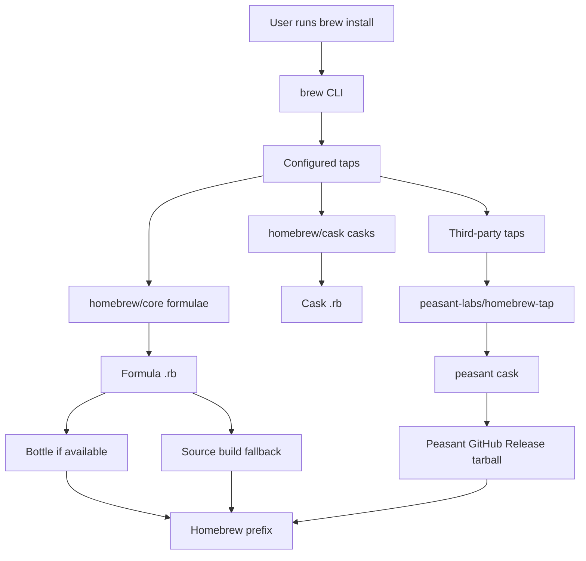
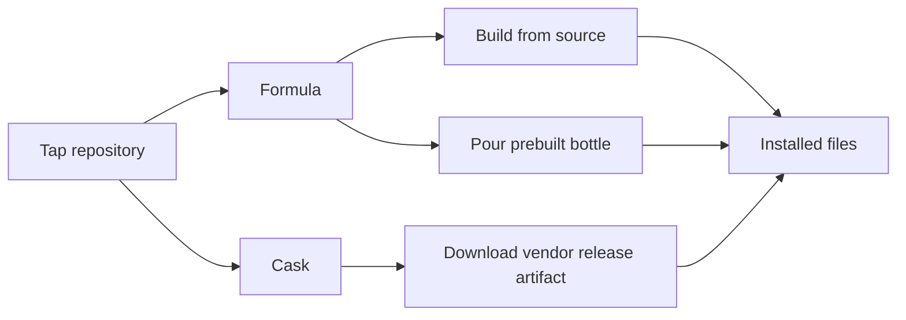
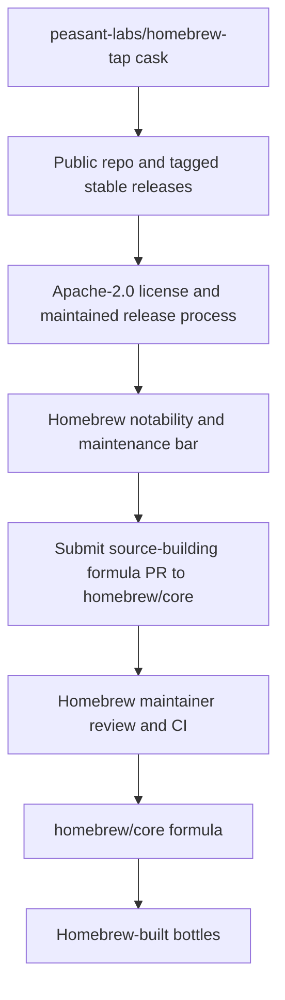

# Installing Peasant on macOS

Peasant ships macOS support through a Homebrew **cask** served from its own tap,
`peasant-labs/homebrew-tap`. Thin per-architecture binaries are published for both
Apple Silicon (`arm64`) and Intel (`amd64`).

> **Availability:** the Homebrew tap is populated starting with the first public
> stable release (`v0.1.0`). Release candidates (`-rcN`) are **not** pushed to the
> tap. Until then, use [Option B](#option-b--raw-binary-tarball).

## Option A — Homebrew (recommended)

```bash
brew tap peasant-labs/tap
brew install --cask peasant
peasant --version
```

Homebrew selects the right binary for your CPU automatically. The cask runs a
post-install hook that clears the download quarantine attribute, so the binary runs
immediately — **no Gatekeeper prompt**.

**Updating:** `brew update && brew upgrade --cask peasant`.
**Removing:** `brew uninstall --cask peasant`.

## Homebrew architecture context

Homebrew is a Git-backed package manager. The `brew` command knows how to update
package definition repositories, resolve a package name to a definition, download
the source or binary artifact described by that definition, verify checksums, and
install files into the Homebrew prefix (`/opt/homebrew` on Apple Silicon by default).



The moving parts:

| Term | What it is | Who usually owns it | How it relates to Peasant |
|------|------------|---------------------|---------------------------|
| `brew` | The Homebrew CLI and package manager implementation | `Homebrew/brew` | Runs `brew tap`, `brew install --cask peasant`, updates taps, verifies checksums, installs files |
| Tap | A Git repository of formulae, casks, and/or external `brew` commands that Homebrew tracks | Homebrew or any third party | Peasant uses `peasant-labs/homebrew-tap`, addressed as `peasant-labs/tap` on the CLI |
| Formula | A Ruby package definition for source-built command-line tools and libraries | Commonly `homebrew/core` | A future `homebrew/core` formula would build Peasant from source and may get Homebrew bottles |
| Bottle | A prebuilt formula keg that Homebrew can pour instead of building from source | Homebrew CI for official formulae; third-party taps can host their own | Peasant does not currently publish bottles; its cask downloads Peasant release archives directly |
| Cask | A Ruby package definition for prebuilt apps or binary artifacts | Commonly `homebrew/cask` or third-party taps | Peasant's v1 macOS channel is a cask generated by Goreleaser |

### Tap, cask, and bottle relationship

A **tap** is where Homebrew finds definitions. A tap can contain formulae, casks,
and external `brew` commands. The one-argument form `brew tap peasant-labs/tap` maps
to the GitHub repository `peasant-labs/homebrew-tap`; Homebrew clones that repository
under its local `Library/Taps` directory and treats the definitions inside as
installable packages. In a tap, formulae normally live under `Formula/` and casks
under `Casks/`.

A **cask** is the definition Peasant uses today. It points at the Darwin release
archives attached to Peasant's GitHub Release and declares how to install the
`peasant` binary. Goreleaser writes this cask into `peasant-labs/homebrew-tap` after
final releases. Release candidates deliberately do not update the tap.

A **bottle** is different: it is a prebuilt artifact for a formula. In official
`homebrew/core`, Homebrew CI builds formulae on supported platforms, writes a
`bottle do` checksum block into the formula, and uploads the bottle. When a user
runs `brew install <formula>`, Homebrew pours the matching bottle automatically if
one exists; otherwise it builds from source. Peasant's current cask path skips that
formula/bottle machinery and installs Peasant's own release tarball.

Homebrew Bundle can express the same setup declaratively in a `Brewfile`:

```ruby
tap "peasant-labs/tap"
cask "peasant"
```

Running `brew bundle` from a directory containing that file makes Homebrew converge
the machine to the requested state: the tap is present and the cask is installed.



### Official vs. unofficial taps

An **official tap** is maintained under the Homebrew GitHub organization, such as
`homebrew/core` for formulae and `homebrew/cask` for casks. A project does not make
its own tap official by renaming it or by using a particular repository layout. The
practical path to official Homebrew distribution is to submit a pull request to the
appropriate Homebrew-maintained repository and meet that repository's acceptance
rules.

For a command-line tool like Peasant, the likely official path is:



Important constraints:

- `homebrew/core` is for formulae. Its policy prefers open-source, source-built
  command-line tools with stable tagged releases, maintainable builds, and enough
  usage signal. Binary-only formulae are not accepted there.
- `homebrew/cask` is for casks. Official cask acceptance is stricter for unsigned,
  obscure, unmaintained, vendorless, or risky artifacts. Open-source CLI-only casks
  are generally expected to try `homebrew/core` first.
- Third-party taps are normal. They are the right channel when a project needs
  faster release cadence, binary distribution before a source formula is practical,
  or packaging behavior that does not fit official repository rules yet.

For Peasant specifically, `peasant-labs/homebrew-tap` is the supported v1 channel.
An official `homebrew/core` formula is deferred until the repository is public, stable
releases exist, and the source build story is acceptable to Homebrew. The open-source
licensing that `homebrew/core` policy prefers is satisfied — Peasant is Apache-2.0. If that happens, Homebrew bottles would be produced by Homebrew's own CI;
the vendor tap can either remain as a faster-update channel or be retired.

## Option B — raw binary tarball

```bash
VERSION=0.1.0
ARCH=arm64    # Apple Silicon; use amd64 for Intel

curl -fLO "https://github.com/peasant-labs/peasant/releases/download/v${VERSION}/peasant_${VERSION}_darwin_${ARCH}.tar.gz"
curl -fLO "https://github.com/peasant-labs/peasant/releases/download/v${VERSION}/checksums.txt"
shasum -a 256 -c checksums.txt --ignore-missing

tar xzf "peasant_${VERSION}_darwin_${ARCH}.tar.gz"
sudo install -m755 peasant /usr/local/bin/peasant     # or ~/bin on PATH
```

### macOS Gatekeeper (raw download only)

The release binaries are **not yet code-signed or notarized**. When you download a
tarball through a **browser**, macOS marks it quarantined and refuses to run it
("cannot be opened because the developer cannot be verified", or an instant kill on
Apple Silicon). Clear the quarantine flag once:

```bash
xattr -dr com.apple.quarantine ./peasant
```

Binaries downloaded with `curl` (as above) or installed via the Homebrew cask are
**not** affected — `curl` doesn't set the quarantine attribute, and the cask removes
it for you.

## Notes

- `go install github.com/peasant-labs/peasant/cmd/peasant@latest` is an alternative
  once the repo is public (needs a Go toolchain). The embedded dashboard is stubbed
  in source builds.
- Code signing + notarization (so raw downloads "just work" with no `xattr` step) and
  a `.pkg` installer are [deferred](../release-runbook.md#deferred-ladder); the
  Homebrew cask is the supported path for now.

## References

- [Homebrew taps](https://docs.brew.sh/Taps)
- [How to create and maintain a tap](https://docs.brew.sh/How-to-Create-and-Maintain-a-Tap)
- [Brew Bundle and Brewfile](https://docs.brew.sh/Brew-Bundle-and-Brewfile)
- [Homebrew bottles](https://docs.brew.sh/Bottles)
- [Adding software to Homebrew: formulae](https://docs.brew.sh/Adding-Software-to-Homebrew#formulae)
- [Adding software to Homebrew: casks](https://docs.brew.sh/Adding-Software-to-Homebrew#casks)
- [Formula Cookbook: Homebrew terminology](https://docs.brew.sh/Formula-Cookbook#homebrew-terminology)
- [Homebrew cask cookbook](https://docs.brew.sh/Cask-Cookbook)
- [Acceptable formulae for `homebrew/core`](https://docs.brew.sh/Acceptable-Formulae)
- [Acceptable casks for `homebrew/cask`](https://docs.brew.sh/Acceptable-Casks)
