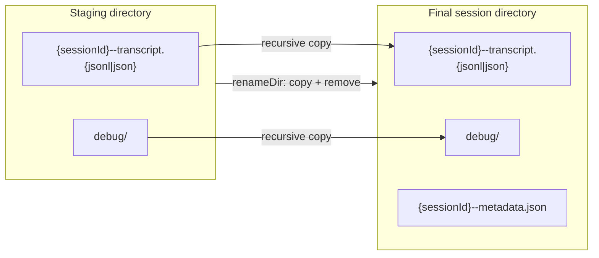
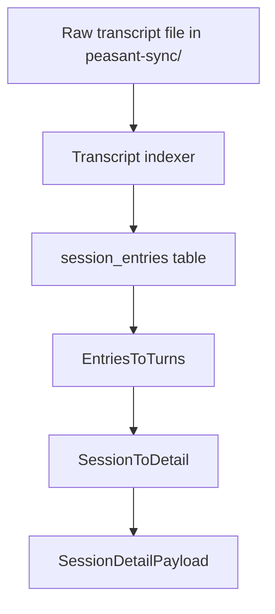

# Pipeline

## Summary

Peasant’s ingest pipeline discovers provider transcripts, normalizes metadata,
writes a complete session directory into `peasant-sync/`, and then populates
the SQLite analytics store. The transcript file on disk stays in the provider
source format (`.jsonl` or `.json`); the canonical display format is produced
later from the DB-backed transcript model.

The pipeline uses a staging directory for publish safety. It writes into a temp
tree first, then moves that tree into the final session directory once the
session output is complete.

## Architecture

### Ingest data flow

```mermaid
flowchart TD
  A[Provider transcript source] --> B[Discover sessions]
  B --> C[Diff against existing metadata]
  C --> D[Filter active/unchanged sessions]
  D --> E[Read raw transcript bytes]
  E --> F[Redact transcript bytes if enabled]
  F --> G[Write transcript into temp dir]
  G --> H[Copy debug artifacts into temp dir]
  H --> I[Compute content + metadata hashes]
  I --> J[DB insert / upsert session state]
  J --> K[Upsert current commits + durable association ledger when observed]
  K --> L[Move temp dir into peasant-sync/{hostSlug}/{sessionId}/]
  L --> M[Write metadata.json in final location]
  M --> N[Report pipeline result]
```

### Publish boundary



### Transcript layers



### Pipeline stages

The ingest command runs a nine-stage pipeline:

1. **DISCOVER** - ask each enabled adapter to enumerate sessions.
2. **DIFF** - classify sessions as new, updated, unchanged, or active.
3. **FILTER** - skip sessions excluded by flags or selection criteria.
4. **EXTRACT+WRITE** - read, redact, and stage the transcript plus debug data.
5. **DB INSERT** - upsert session state into SQLite, including the current Git
   commit projection and durable association ledger when commit detection found
   observed commits.
6. **INDEX** - parse the on-disk transcript into `session_entries`.
7. **COMPUTE** - derive metrics from indexed entries.
8. **CLEANUP** - remove orphan `.tmp-*` directories.
9. **REPORT** - return the final pipeline summary.

The first four stages are the file-facing ingest path. The middle stages are
DB-backed, and the last two are cleanup plus reporting.

## Write Flow

The ingest implementation follows this sequence:

1. Read the source transcript bytes from the provider path.
2. Redact the bytes if a redactor is configured.
3. Write the transcript to a temp directory under the output base.
4. Copy any provider debug artifacts into the same temp directory.
5. Compute transcript and metadata hashes from the final bytes.
6. Insert or update the DB state. This includes replacing the mutable
   `session_commits` projection and ensuring durable
   `session_commit_associations` rows exist for every observed commit.
7. Move the temp tree into `peasant-sync/{hostSlug}/{sessionId}/`.
8. Write `metadata.json` after the publish step in the store-backed path.

The temp directory is intentionally placed under the output base so the final
publish step stays on the same filesystem. The implementation does not try to
stream directly into the final session directory.

### ASCII fallback

```text
source transcript
   │
   ▼
redact bytes (optional)
   │
   ▼
write tmpDir/{sessionId}--transcript.{jsonl|json}
   │
   ├── copy debug/
   ├── compute hashes
   ├── DB insert / update
   ▼
publish into peasant-sync/{hostSlug}/{sessionId}/
   │
   └── write metadata.json
```

## Why Staging Exists

The pipeline does not write straight to the final session directory. It stages
the transcript and debug files first, then publishes the directory once the
session output is complete.

That gives two properties:

1. A session directory appears complete instead of partially written.
2. The on-disk transcript tree and the SQLite state stay ordered within a run.

The tradeoff is extra filesystem work. That is intentional. The pipeline
chooses a safe publish boundary over a direct write into the final directory.

The same pattern exists on the pull path, where docs explicitly call out the
staging/publish boundary and the copy-plus-remove implementation.

## Commit Association Ledger

Commit detection is a source-fact producer. When it supplies observed commits for
a session, ingest updates two related store surfaces:

1. `session_commits` is the current projection. Re-ingest replaces it so map and
   review surfaces can reflect the session's latest observed commit set.
2. `session_commit_associations` is the durable ledger. It allocates or replays a
   stable association ID for each `(session_id, observed_commit_hash)` pair before
   replacing the current projection.

The ledger is append-only for a session's lifetime and intentionally separate
from annotations. Commit detection creates ledger rows only for the commits it
observes, while the V40 migration backfills legacy `session_commits` rows. Normal
ingest and migration backfill create association ledger rows only; they do not
create association-target annotations. Such annotations are semantic/provenance-
bearing records and must be written by an explicit eligible local producer, for
example a human label, an annotator/miner/classifier, or an intentional local
import. Pulled foreign annotations and data are one-way and never become local
push or re-push candidates. An automatic "association exists" annotation would
duplicate the ledger fact and add noise to the network annotation path.

Upgrade behavior follows the same rule. The migration that backfills durable
association IDs for pre-existing `session_commits` rows marks only affected,
already-pushed sessions as ordinary push candidates once. That sends the missing
Village association anchors before any later association-target annotation batch,
without requiring users to discover `--force`.

## Claude Discovery Evidence Cache

Claude Code does not record which teammate session belongs to which parent
session. Discovery mines that link from the transcripts themselves: it reads a
root transcript and collects the identity the session declares and the teammates
the session spawned. A link is accepted only when exactly one child and exactly
one parent share one complete identity.

Mining reads a whole transcript and parses every line, so the cost used to grow
with the total transcript bytes on disk on EVERY scan. The `claude_transcript_evidence`
table now holds the mined result of each transcript, keyed on the source path and
stamped with the size and the modification time of the file that produced it.

Rules:

- Discovery stats each transcript, then reuses the cached record when the scope,
  the size, and the modification time all agree.
- A new or changed transcript is mined again, and the fresh record replaces the
  cached one. The ambiguity rule is unchanged.
- One read now produces every content fact discovery needs: the conversation
  check, the teammate identity, the spawn records, and the display hints.
- Discovery deletes the records of transcripts that are gone, but only under the
  source paths that the run walked.
- The cache is best effort. A missing or failing cache makes discovery mine every
  transcript again, which is slower and always correct.

Both discovery paths use it. The ingest pipeline passes the local store to the
Claude adapter, and the kickstart scan opens the same store for the recorded
session index and for this cache.

## Failure Modes

The temp tree is also a cleanup boundary:

- `.tmp-*` directories are scanned and removed as orphans on later runs.
- If transcript writing fails, the temp tree is removed and the session is not
  published.
- If the recursive publish step fails, the temp tree is removed and the final
  session directory is left untouched or re-created on the next run.
- Debug file copy failures are non-fatal; they are recorded in diagnostics and
  the session is marked partial.

The recursive publish helper is portable across the real filesystem and the
test filesystem abstraction. In this codebase it is not a single OS rename of a
directory tree; it is a recursive copy followed by removal of the staging tree.

## Canonical Transcript Format

Peasant has a separate normalized transcript view for consumers:

- `session_entries` in SQLite stores the normalized entry tree.
- `EntriesToTurns` folds those rows into display-ready turns.
- `SessionToDetail` wraps the turns into `SessionDetailPayload`.

That is the canonical transcript format for the API and export surfaces. It is
derived from stored transcript data, not written directly to `peasant-sync/`.

## Related Docs

- [README](../README.md) for the top-level ingest layout.
- [Network Boundary Reference](NETWORK.md) for what association anchors and
  association-target annotations send over the Village push boundary.
- [Village Pull Architecture](pull.md) for the analogous staged publish flow.
- [Sessions](sessions.md) for the DB-backed transcript representation.
- [CLI `harvest logs`](cli/peasant_harvest_logs.md) for the user-facing
  extraction command.
