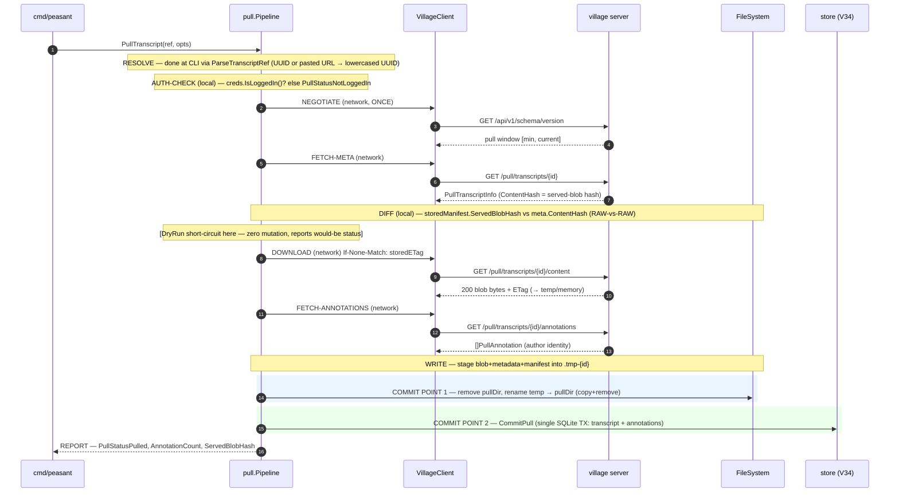
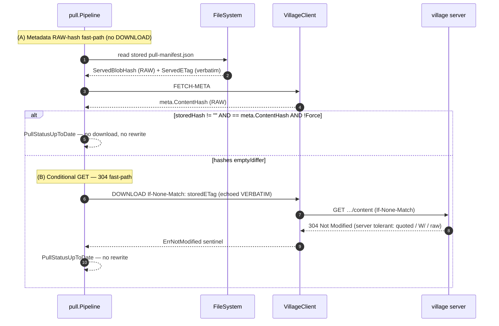
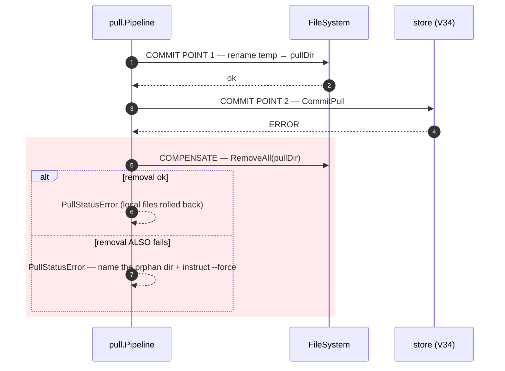
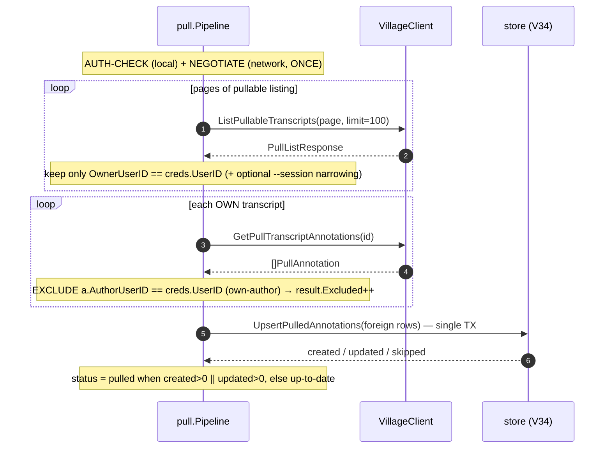

# Village Pull Architecture

> How the elements in the **transcript pull surface** and matching Village API fit
> together — components, flows, and the
> allowed / NOT-allowed
> cases. Companion: [Peasant ↔ Village Auth Model](auth.md) (the authorization
> matrices and login model). The wire contract is the current **Village API
> OpenAPI spec**, generated and published by the
> `github.com/peasant-labs/schema` module.

`peasant village transcripts pull` retrieves a transcript (and the annotations
authored on it) that the requester **owns** or that is **group-shared** with them,
and lands it in a **separate** `village-pulls/` namespace plus the V34
`pulled_transcripts` / `pulled_annotations` tables. Pulled data is **foreign and
one-way**: it never enters the ingest (`peasant-sync/`) tree, the `sessions`
analytics tables, or the annotate-push candidate set.

---

## 1. Component map (ownership boundaries and interfaces)

Each box is owned by exactly one package. The arrows show the public interfaces
between packages. Network hops are marked `⇄ HTTP`.

```
                            PEASANT CLI process                                  │  VILLAGE server
                                                                                 │
 ┌─────────────────────────────────────────────────────────────────────────┐   │
 │ cmd/peasant  (CLI wiring — owns flags, output, exit codes)                │   │
 │                                                                           │   │
 │   village transcripts pull <ref>     buildVillageTranscriptsPullCommand   │   │
 │   village transcripts list [--local] buildVillageTranscriptsListCommand   │   │
 │   village transcripts context <ref>  buildVillageTranscriptsContextCommand│   │
 │   village annotations sync           buildVillageAnnotationsSyncCommand   │   │
 │                                                                           │   │
 │   requireVillageCredentials() ── auth gate (mirrors cmd_push.go) ─┐       │   │
 │   TurnsToEntries() → renderSessionContextHuman()  (OFFLINE render)│       │   │
 └───────────┬──────────────────────────────────────────────────────┼───────┘   │
             │ pipeline constructor + ParseTranscriptRef             │           │
             ▼                                                       ▼           │
 ┌──────────────────────────────────┐         ┌──────────────────────────────┐  │
 │ internal/pull  (Pipeline)        │         │ internal/auth (Credentials)  │  │
 │  OWNS the 9-stage staged flow    │◄────────┤  loopback OAuth login,       │  │
 │  DI ifaces (consumer-side):      │  creds  │  credentials.json (0600)     │  │
 │   • VillageReader                 │         └──────────────────────────────┘  │
 │   • PullStore                     │                                           │
 │   • FileSystem (ingest.FS)        │                                           │
 │   • Clock                        │                                           │
 │  PullManifest / ManifestVersion  │── on-disk provenance                     │
 └───────┬──────────────┬───────────┘                                           │
         │ client       │ store                                                  │
         ▼              ▼                                                        │
 ┌────────────────┐  ┌──────────────────────────┐                               │
 │internal/village│  │ internal/store (V34)     │                               │
 │ VillageClient  │  │  pulled_transcripts      │                               │
 │  NegotiatePull │  │  pulled_annotations      │                               │
 │  + 4 pure GETs │  │  CommitPull (1 SQLite TX)│                               │
 │  err sentinels │  │  UpsertPulledAnnotations │                               │
 │  (ErrNotMod… , │  │  ListPulledTranscripts   │                               │
 │   ErrPullNot…, │  └──────────────────────────┘                               │
 │   ErrPullContr)│                                                             │
 └───────┬────────┘                                                             │
         │ ⇄ HTTP  (Bearer apiKey)                                              │
         ▼                                                                      ▼
 ─────────────────────────────────────────────────────────────────────────────────
                                              ┌───────────────────────────────────┐
                                              │ village backend/internal/handler  │
                                              │  GET /api/v1/schema/version        │
                                              │      (pull window advertise)       │
                                              │  GET /api/v1/pull/transcripts      │
                                              │  GET /api/v1/pull/transcripts/{id} │
                                              │      …/{id}/content  (content_hash │
                                              │                       → ETag/304)  │
                                              │      …/{id}/annotations            │
                                              │  canPullTranscript()  ── ABAC seam │
                                              │  AuthRequired middleware           │
                                              └───────────────────────────────────┘
```

### Interface boundaries

| Boundary | Contract | Owner ↔ Consumer |
|----------|----------|------------------|
| Wire annotations array | **bare** `[]PullAnnotation` JSON (NOT `{"annotations":[…]}`) | village handler → `github.com/peasant-labs/schema` |
| `VillageReader` | `NegotiatePull` + 4 pure GETs; `*village.VillageClient` satisfies it structurally | `internal/pull` (declares) ← `internal/village` (impl) |
| `PullStore` | `CommitPull` (1 TX) + `UpsertPulledAnnotations` + 2 reads; `*store.Store` satisfies it | `internal/pull` (declares) ← `internal/store` (impl) |
| CLI ↔ pipeline | `ParseTranscriptRef` + `NewPipeline(reader, fs, store, clock, creds, pullsRoot)` | `cmd/peasant` ↔ `internal/pull` |
| `FileSystem` | reuses `ingest.FileSystem` (`OSFileSystem` prod, `MemFS` test) | `internal/pull` ← `internal/ingest` |
| HTTP pull surface | `/api/v1/pull/*` + `/schema/version` pull window, Bearer apiKey | `internal/village` ⇄ village handler |
| On-disk provenance | `pull-manifest.json` (`PullManifestVersion = 1`) | `internal/pull` (writes) → `cmd context` + e2e (read) |

The four pull GETs are **pure data calls** — they do NOT re-preflight the pull
window. The explicit **NEGOTIATE** stage (`VillageClient.NegotiatePull`) runs
**exactly once** per command (in the pipeline op, or once before the remote
`list` GET), mirroring how push splits `negotiate()` from the transport client.

---

## 2. Happy-path pull — the nine stages

`Pipeline.PullTranscript` runs a staged flow. Network-vs-local is marked; the two
"commit points" are the **dir rename** (filesystem) and the **DB-TX**
(`CommitPull`). Tested by `TestPullTranscript_HappyPath`
(`internal/pull/pipeline_test.go`) and end-to-end by the e2e harness.



**Error doctrine (inverted fail-open vs push):** any failure in
`RESOLVE…FETCH-ANNOTATIONS` leaves **zero local mutation** (the temp dir, if
created, is removed). All network I/O completes into a temp dir / memory
**before** commit point 1.

---

## 3. Re-pull when already up-to-date — both fast paths

Idempotency has **two** routes to `up-to-date`, settled in DIFF order:



The **ETag vs raw-hash split** (manifest `servedETag` vs `servedBlobHash`) is
deliberate: the ETag is the **transport token** (echoed verbatim as
`If-None-Match`, the village quotes it `"<hash>"`); the raw blob hash is the
**content-identity key** (always unquoted, what the metadata fast-path and
`pulled_transcripts.content_hash` compare). The server's `ifNoneMatchMatches`
(village `pull.go`) tolerates the quoted ETag, a weak `W/` prefix, and the raw
hash, all against the same hash. Tested by `TestPullTranscript_UpToDate_HashMatch`,
`TestPullTranscript_UpToDate_Via304`, and `TestPullTranscript_ETagHashSplit`
(peasant) and `TestPull_Content_ETag_And_304` (village `pull_test.go`).

---

## 4. Failure + compensation — the rename ↔ DB-TX window

The **only** window where a partial state can survive is **between** the two
commit points: the rename succeeded but `CommitPull` failed.



**Cache / derived-index doctrine.** The V34 tables are a **derived index** of the
on-disk `village-pulls/` manifests; foreign pulled data is re-pullable, so a
files↔DB divergence is **repaired by `--force` re-pull**, never by manual DB
surgery (`schema_v34.go` doc).

**Re-pull-replace caveat.** The compensating `RemoveAll(pullDir)` restores the
exact pre-pull state **only for a first pull** (no prior dir). On a re-pull-replace
the prior good copy was already removed **before** the rename, so a DB-TX failure
leaves **no** local copy while the DB still holds the **old (stale)** row — not a
true restore. Under the cache doctrine this is acceptable: `--force` re-downloads
and overwrites the stale row. The pipeline does **not** save-old→backup.

**Known limitation (mirrors ingest M11).** The WRITE "publish" is `copy+remove`
(recursive `MkdirAll` + per-file `CopyFile` + `RemoveAll(src)`), **NOT** an OS
atomic rename. A crash mid-publish leaves a manifest-less partial dir with no DB
row; the derived-index doctrine + `--force` cover that window. Tested by
`TestPullTranscript_DBTxFailure_CompensatingRemoval`,
`TestPullTranscript_CompensationFailure_NamesOrphan`,
`TestPullTranscript_PreWriteFailure_ZeroMutation`, and the staging/rename failure
cases (`TestPullTranscript_StageFilesFailure_ZeroMutation`,
`TestPullTranscript_RenameDirFailure_Cleanup`) in `pipeline_test.go`.

---

## 5. Annotations sync — own-author exclusion

`peasant village annotations sync` (`Pipeline.RefreshOwnAnnotations`) refreshes the
**foreign** annotations other village users authored on the requester's **own**
pushed transcripts. It touches **no files** (annotations only) — a failure simply
leaves `pulled_annotations` unchanged.



`transcript_id` on `pulled_annotations` has **no foreign key** — a refreshed
annotation may target an own pushed transcript that has no `pulled_transcripts`
row. Tested by `TestRefreshOwnAnnotations_ExcludesOwnAuthor`,
`TestRefreshOwnAnnotations_RealStore_CreatedThenSkipped`,
`TestRefreshOwnAnnotations_BySession`, and `TestRefreshOwnAnnotations_MultiPage`
(`internal/pull/refresh_test.go`), plus
`TestVillageSync_HappyPath_ForeignLandsOwnExcluded` (`cmd_village_stub_test.go`).

---

## 6. Allowed / NOT-allowed cases

Every row cites its existing test (file + test name). Authorization
allowed/denied (who may pull what) lives in [auth.md §4–5](auth.md); this section
covers **reference forms, idempotency, storage, error, and legacy** semantics.

### 6.1 Reference forms (`ParseTranscriptRef`)

A URL reference is accepted **only** when its path is the canonical
`/transcripts/<uuid>` shape (exactly one `transcripts` segment followed by exactly
one UUID segment; an optional trailing slash and query strings are allowed). The
parser anchors on the PATH SHAPE — it does **not** accept any URL whose last
segment merely happens to be a UUID — so collection-mismatch and extra-tail
lookalikes (`/users/<uuid>`, `/transcripts/<uuid>/annotations/<uuid>`) are
rejected rather than silently resolving the wrong UUID.

| Input | Outcome | Test |
|-------|---------|------|
| bare canonical lowercase UUID | ✅ `TranscriptRef{FromURL:false}` | `TestParseTranscriptRef` (`internal/pull/types_test.go`) |
| pasted village web URL `…/transcripts/<uuid>` (canonical shape; trailing slash + query string allowed) | ✅ UUID extracted, `FromURL:true` | `TestParseTranscriptRef` |
| **uppercase** UUID (bare or in URL) | ✅ case-normalized to lowercase | `TestParseTranscriptRef` |
| empty / whitespace | ❌ actionable empty-ref error | `TestParseTranscriptRef` |
| host-only URL / no `/transcripts/<uuid>` path | ❌ actionable "not a village transcript URL" | `TestParseTranscriptRef` |
| `/transcripts/<non-uuid>` slug, or bare non-UUID / truncated id / `<uuid>-extra` suffix | ❌ actionable "not a transcript UUID" | `TestParseTranscriptRef` |
| **wrong-collection** URL `…/users/<uuid>` | ❌ rejected on path shape — "not a village transcript URL" | `TestParseTranscriptRef` (`lookalike/wrong-path-shape`) |
| **extra-tail** URL `…/transcripts/<uuid>/annotations/<uuid>` | ❌ rejected on path shape (would otherwise extract the WRONG, annotation, UUID) — "not a village transcript URL" | `TestParseTranscriptRef` (`lookalike/double-uuid-path`) |
| pasted **foreign-village** URL (canonical shape) | ⚠️ host discarded; resolves against the **logged-in** village (typically 404) | `TestPullTranscript_ByURL` (`pipeline_test.go`) — current single-village behavior |

### 6.2 Idempotency outcomes (`PullStatus`)

| Situation | Status | Test |
|-----------|--------|------|
| fresh pull (no prior copy) | `pulled` | `TestPullTranscript_HappyPath` |
| stored RAW hash == server RAW hash, not `--force` | `up-to-date` (no download) | `TestPullTranscript_UpToDate_HashMatch` |
| conditional GET → 304 | `up-to-date` (no rewrite) | `TestPullTranscript_UpToDate_Via304` |
| `--force` (matching copy) | `pulled` (re-download + rewrite) | `TestPullTranscript_Force_BypassesDiff` |
| `--dry-run`, would download | `pulled` + `DryRun:true`, **zero mutation** | `TestPullTranscript_DryRun_WouldPull` |
| `--dry-run`, already current | `up-to-date` + `DryRun:true` | `TestPullTranscript_DryRun_UpToDate` |
| no server hash, byte-identical local copy | `up-to-date` (local recompute) | `TestPullTranscript_NoServerHash_LocalRecompute` |

### 6.3 Storage invariants

| Invariant | Holds because | Test / source |
|-----------|---------------|---------------|
| pulled blobs land **only** in `village-pulls/{host}/{id}/` | `Pipeline.pullDir` joins `pullsRoot` (= `defaults.VillagePullsDirPath`) | `TestPullTranscript_HappyPath` (asserts pull dir) |
| **never** writes `peasant-sync/` or `sessions` tables | pull path has no ingest/analytics dependency (foreign, one-way by design) | `internal/pull` imports (no ingest writer); e2e pollution gate |
| V34 tables are a **re-pull-repairable derived index** | `--force` re-downloads + overwrites; no manual DB surgery | `schema_v34.go` doc; `TestPullTranscript_Force_BypassesDiff` |
| pulled data is **never pushed back** | not in the annotate-push candidate set (foreign, one-way) | one-way-by-design; `cmd_village_pull.go` Long help |
| each pull dir carries `pull-manifest.json` (`PullManifestVersion = 1`) | `stageFiles` writes manifest alongside blob+metadata | `TestPullTranscript_HappyPath`; e2e asserts manifest |

### 6.4 Error doctrine

| Failure | Effect | Test |
|---------|--------|------|
| any pre-WRITE failure (auth/negotiate/meta/download/annotations/stage) | **zero local mutation** | `TestPullTranscript_PreWriteFailure_ZeroMutation`, `TestPullTranscript_StageFilesFailure_ZeroMutation`, `TestPullTranscript_StageMkdirFailure_ZeroMutation` |
| DB-TX fails after rename | compensating `RemoveAll(pullDir)`, `PullStatusError` | `TestPullTranscript_DBTxFailure_CompensatingRemoval` |
| DB-TX fails **and** cleanup fails | error names orphan dir + instructs `--force` | `TestPullTranscript_CompensationFailure_NamesOrphan` |
| an error is **never** reported as `up-to-date` | `classifyStatus` panics on nil; success reported directly by caller | `pipeline.go` `classifyStatus` doc; `TestPullTranscript_NotFound`, `TestPullTranscript_ContractError` |
| village too old (no pull window) | `contract-error` (fail **closed**, unlike push) | `TestNegotiatePull_MissingWindow_AbortsActionably` (`internal/village/pull_test.go`) |
| not pullable / not found | `not-found` (404, no existence leak) | `TestPullTranscript_NotFound`; village `TestPull_NotFound_Variants` |

### 6.5 Legacy pre-envelope blobs

| Action | Allowed? | Test |
|--------|----------|------|
| **pull** a legacy (pre-`TranscriptContent`-envelope) blob | ✅ yes — pull is contract-agnostic on blob shape | (pull stages do not decode the blob) |
| **`context` render** a legacy blob | ❌ no — actionable "unsupported blob contract" (manifest-axis: empty `BlobContractVersion`; decode-axis: not a `TranscriptContent` envelope) | `TestVillageContext_LegacyBlob_ActionableError` (`cmd_village_transcripts_test.go`) |

Full legacy-blob rendering is not implemented. The command returns an actionable
unsupported-contract error rather than silently rendering incomplete content.

---

## 7. Manifest format (`pull-manifest.json`)

The per-transcript provenance record (`internal/pull/manifest.go`,
`PullManifestVersion = 1`) is the **on-disk source of truth** that the V34 tables
index. A **golden example** is committed in the `github.com/peasant-labs/schema`
module (embedded pull fixture `testdata/pull/manifest.example.json`) with a
round-trip shape-pin test.

| Field | Meaning |
|-------|---------|
| `manifestVersion` | `PullManifestVersion` at write time |
| `villageURL` / `villageHost` | full base URL pulled from; host = on-disk namespace key |
| `transcriptId` / `localSessionId` | village UUID; peasant SessionID at publish (round-trip correlation, optional) |
| `ownerUserId` / `ownerUsername` | village account identity of the owner |
| `servedETag` | **verbatim** ETag (possibly quoted) — re-pull conditional-GET token |
| `servedBlobHash` | **RAW** content-identity hash — the pull-idempotency key |
| `blobContractVersion` | push contract the blob was published under (empty ⇒ legacy → `context` errors) |
| `pullEnvelopeVersion` | pull-contract version the transfer negotiated under |
| `pulledAt` | unix-millis at WRITE time |
| `annotations[]` | per-annotation `{contentHash, authorUserId, authorUsername}` provenance |

---

## See also

- [Peasant ↔ Village Auth Model](auth.md) — login, wire auth, command gates, the
  `canViewTranscript` vs `canPullTranscript` matrices, future seams.
- [End-to-end harness](e2e.md) — the pull round-trip + table-level pollution gate.
- current Village API OpenAPI spec, generated and published by the
  `github.com/peasant-labs/schema` module.
