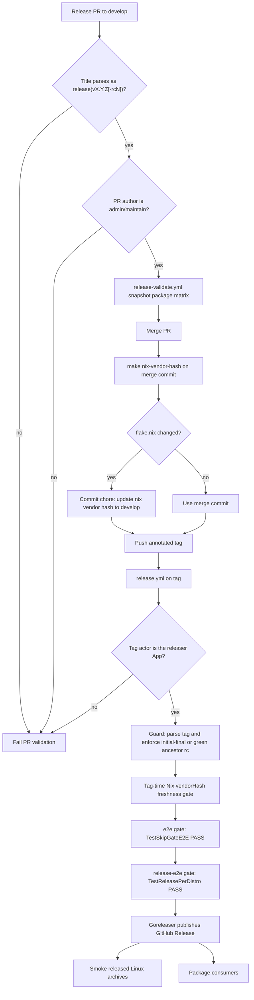
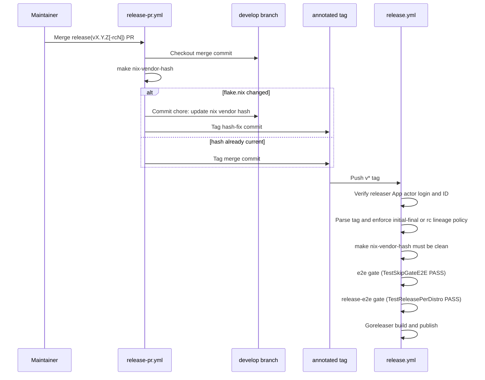
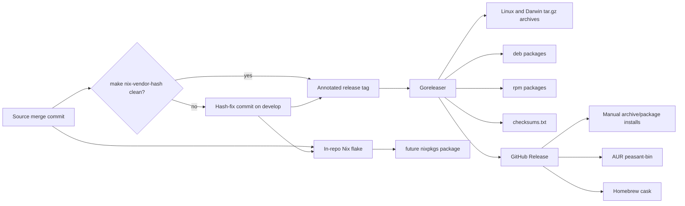
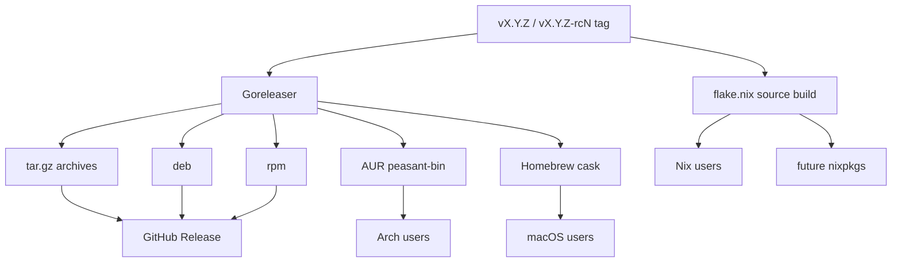

# Peasant Release Architecture

This document is the maintainer-facing reference for the release system: which
workflow owns which invariant, how release data moves from source commits into
packages, and why tags are created only after Nix hash freshness has been proven.
For operator steps, use the [release runbook](release-runbook.md).

## Overview

Peasant has one canonical release producer: an annotated `vX.Y.Z` or
`vX.Y.Z-rcN` tag. That tag drives one GitHub Release through Goreleaser. Archives,
checksums, `.deb`, `.rpm`, AUR, Homebrew, and Nix are consumers of that frozen
source state.

The split is intentional:

- `release-pr.yml` owns release intent: title grammar, maintainer authorization,
  duplicate-tag refusal, and pre-tag Nix hash repair. The maintainer-approval
  assertion remains deferred for the single-maintainer repository.
- `release.yml` owns immutable tag publication: final-vs-rc lineage, tag-time Nix
  hash freshness, the **`e2e` + `release-e2e` publication gates** (both must pass
  before Goreleaser runs), Goreleaser publication, and post-publish smoke.
- `e2e.yml` / `release-e2e.yml` are reusable workflows `release.yml` calls on
  **every** release tag (rc and final): `e2e.yml` proves the full-stack push
  skip-gate (`TestSkipGateE2E`) and `release-e2e.yml` proves installed per-distro
  packages (`TestReleasePerDistro`). Each must emit a positive `--- PASS` line; a
  SKIP or "no tests to run" **fails** the gate — no asserted coverage ⇒ no publish.
- `release-validate.yml` owns package installability before a tag is minted and
  again on rc tags.
- `nix-vendor-hash.yml` keeps `develop` close to release-ready after dependency
  and package-input changes.



## Trigger Model

Release intent is expressed only by a PR title into `develop`:

```text
release(vX.Y.Z): <summary>        -> final release
release(vX.Y.Z-rcN): <summary>    -> release candidate
```

The grammar is implemented in the shared `github.com/peasant-labs/schema/cmd/release-guard`
tool; the workflows call it via `go run github.com/peasant-labs/schema/cmd/release-guard …`
instead of duplicating regexes in YAML, and peasant's per-repo job-graph expectations live
in `.github/release-guard.policy.yml`. Schema releases occur in the standalone schema
repository and cannot trigger Peasant's workflow.

Open release PRs are validated early. The title must parse, and the PR author must
have GitHub collaborator permission `admin` or `maintain`. The approval assertion is
deferred because GitHub does not permit self-approval and there is one active maintainer.

Merge-time tagging checks out the PR merge commit and runs `make nix-vendor-hash`
before creating the tag. If `flake.nix` changes, the release bot commits
`chore: update nix vendor hash` to `develop` and tags that new hash-fix commit. This
matters because a release tag is immutable source: a stale `vendorHash` cannot be
repaired after the tag has already published without moving the tag.

RC tags publish GitHub prereleases. The exact first final `v0.1.0` may bootstrap only
while a complete tag scan proves no other `v*` tag exists and the GitHub Release lookup
proves that `v0.1.0` has not already published. That durable Release self-disables the
exception. Later final tags publish full releases only if a same-version rc tag exists,
that rc's `release.yml` run succeeded, and the rc tag is an ancestor of the final commit.

An active repository ruleset permits only GitHub App ID `3988034`
(`peasant-labs-releaser`) to create or mutate `v*` tags. `release.yml` independently
verifies the stable bot login `peasant-labs-releaser[bot]` and bot actor ID
`291504229` before processing a tag. GitHub therefore rejects manual tags at the ref
boundary; if the repository policy drifts, the workflow actor guard still stops
publication.



## Workflow Map

| Workflow | Triggers | Purpose | Mutates repo? | Required credentials |
|----------|----------|---------|---------------|----------------------|
| `tests.yml` | PRs and pushes touching Go, schema, Makefile, ast-grep, or flake files | Runs `nix develop -c make check`; also verifies `CGO_ENABLED=0` build behavior and module-zip buildability | No | `GITHUB_TOKEN` read |
| `nix-vendor-hash.yml` | Pushes to `develop` touching `go.mod`, `go.sum`, `web/package.json`, `web/pnpm-lock.yaml`, flake files, `Makefile`, hash script, or the workflow; manual dispatch | Keeps `flake.nix` `vendorHash` current on `develop` | Yes, commits `chore: update nix vendor hash` when needed | GitHub App token with `Contents: write` |
| `release-pr.yml` | PR open/edit/synchronize/reopen/close into `develop` | Validates release PR title/author; on merge updates Nix hash and pushes an immutable annotated tag | Yes, possibly commits hash fix and pushes tag | `GITHUB_TOKEN` read for collaborator checks; GitHub App token with `Contents: write` |
| `release-validate.yml` | PRs to `develop` touching packaging-relevant files; `workflow_call` from rc releases | Builds a Goreleaser snapshot and validates deb, rpm, AUR PKGBUILD, Homebrew cask style/install, and `nix build .#peasant` | No | `GITHUB_TOKEN` read |
| `release.yml` | Push tags matching `v*` | Verifies the releaser App actor, guards tag lineage, checks Nix hash freshness, runs the **`e2e` + `release-e2e` publication gates** (both must PASS before publish), publishes via Goreleaser, smokes released archives; also fans out `release-validate.yml` on rc tags (non-blocking) | Publishes GitHub Release; may push AUR/tap only after separate publisher approval | `GITHUB_TOKEN` contents write/actions read; GitHub App token for `homebrew-tap`; `AUR_KEY` after AUR approval |
| `e2e.yml` | PRs to `develop` on relevant paths; `workflow_call`; pushes to `develop`/`main`; manual dispatch | Full-stack push skip-gate (podman Postgres + MinIO + real village server + peasant CLI); asserts a positive `--- PASS: TestSkipGateE2E` — a SKIP or `no tests to run` fails the job | No | Read-only `GITHUB_TOKEN`; Village and schema are public |
| `release-e2e.yml` | `workflow_call`; manual dispatch | Installed-binary / per-distro release gate; asserts a positive `--- PASS: TestReleasePerDistro` | No | Read-only `GITHUB_TOKEN`; Village and schema are public |

## Release Data Flow



Nix and Goreleaser coexist because they serve different consumers. Goreleaser
produces the published binary artifacts and package metadata from a tag. The in-repo
flake provides a source-build path for Nix users and for future nixpkgs packaging.
`vendorHash` is part of the Nix source-build contract, so the tag must already contain
the current hash even though Goreleaser itself does not use Nix to build release
archives.

### Pinned Goreleaser cask patch

Release and snapshot workflows intentionally build GoReleaser v2.17.1 from verified
upstream commit `83f4c19a5c5c0b9efef6bf2aedc6805bbcb9dfe2` using
`scripts/install-goreleaser`. The source patch in
`scripts/goreleaser-v2.17.1-homebrew.patch` corrects two behaviors in that release's
Homebrew cask generator: architecture blocks are emitted as `on_arm` then `on_intel`,
and sibling `on_macos` and `on_linux` blocks are adjacent rather than separated by an
empty line. The template also removes its otherwise-empty trailing block-body line.
Current Homebrew requires all three style rules.

Treat the tool version, verified source commit, patch, and the wiring in
`release.yml`, `release-e2e.yml`, and `release-validate.yml` as one release-tool
contract. Update and verify them together with `goreleaser check`, snapshot artifact
generation, the package matrix, and the full `brew style` suite. Retire the local
patch once an adopted upstream GoReleaser release generates this cask without any
Homebrew style exceptions.

## Packaging Matrix

| Package format | Target OS/arch | Producer | Validation job | Publish status | Constraints |
|----------------|----------------|----------|----------------|----------------|-------------|
| `.tar.gz` archives | Linux amd64/arm64, Darwin amd64/arm64 | Goreleaser `archives` | `release.yml` smoke for Linux amd64/arm64; macOS cask install on rc | GitHub Release | Names are frozen; binary is `peasant`; version injected by ldflags |
| `.deb` | Ubuntu/Debian amd64/arm64 | Goreleaser `nfpms` | `release-validate.yml` deb matrix on Ubuntu 22.04/24.04 | GitHub Release | Empty `Depends`; static binary installed to `/usr/bin/peasant` |
| `.rpm` | Fedora/openSUSE; **produced** amd64+arm64, **validated** amd64 | Goreleaser `nfpms` | `release-validate.yml` Fedora `dnf` and openSUSE `zypper --allow-unsigned-rpm` (amd64) | GitHub Release | Unsigned local rpm install in validation; artifact name `peasant_{version}_linux_{amd64\|arm64}.rpm` (goreleaser `file_name_template`, not the conventional `name-version-release.arch`) |
| AUR `peasant-bin` | Arch Linux x86_64 | Goreleaser `aurs` | Offline `makepkg` with local release tarball and full checksum verification | Disabled for `v0.1.0` via `skip_upload: true`; separate approval changes it to `auto` for a later final | Requires public repo and `AUR_KEY`; prereleases remain skipped with `auto` |
| Homebrew cask | macOS amd64/arm64 | Goreleaser `homebrew_casks` | `brew style` on Linux; cask install on macOS for rc tags | Disabled for `v0.1.0` via `skip_upload: true`; separate approval changes it to `auto` for a later final | Requires tap repo and GitHub App `Contents: write`; unsigned binary uses quarantine-removal hook |
| In-repo Nix flake | Nix systems supported by the flake | `flake.nix` `buildGoModule` | `release-validate.yml` `nix build .#peasant`; `release.yml` hash freshness | Available from source checkout/GitHub flake | Requires current `vendorHash`; stubs `web/out` until frontend derivation exists |
| Future nixpkgs | nixpkgs-supported systems | nixpkgs expression | Future nixpkgs CI plus local update checks | Deferred until a stable GitHub release exists | Requires public repo, tagged release, maintainer metadata; the license requirement is met (Apache-2.0, free) |



## Build Constraints

Release binaries are built with `CGO_ENABLED=0`. That gives static Linux binaries and
keeps distro packages free of shared-library dependencies. The consequence is that
Maximum redaction, which currently depends on tree-sitter through cgo, must hard-error
actionably in release binaries instead of silently weakening behavior.

The binary embeds `web/out`. Release and snapshot workflows run `make web` and
explicitly reject the compile-only stub before Goreleaser. A frontend build failure
therefore blocks every artifact-producing path.

Nix uses `buildGoModule`, so `vendorHash` is a fixed-output hash over the vendored Go
module graph. The schema contract is a normal tagged module dependency
(`github.com/peasant-labs/schema`, pinned in `go.mod` with no `replace`), so a
first-party edit to the schema module's sources no longer moves peasant's
`vendorHash` — only a `go.mod`/`go.sum` change (re-pinning the module) does.
Web package manifests are also treated as packaging-relevant inputs because the
release build embeds the dashboard output.

External package publication remains disabled until its operational checklist is complete.
The project is licensed Apache-2.0. Publication still requires branch protection, a GitHub App with
`Contents: write` on both the source repo and the Homebrew tap, and an AUR key. `release.yml` mints the short-lived tap token from the
App installation; there is no long-lived tap token secret. Until then, Goreleaser
keeps AUR and Homebrew cask upload disabled.

macOS binaries are not signed or notarized yet. For `v0.1.0`, browser-downloaded raw
tarballs require the manual `xattr -dr com.apple.quarantine ./peasant` step documented
in the macOS install guide. The planned Homebrew cask includes a post-install
quarantine-removal hook, but it applies only after Homebrew publication is separately
approved and enabled. Signing, SBOMs, cosign signatures, and provenance attestations
are deferred release-hardening work.

## Failure Modes

| Failure | Owner | What happens | Operator response |
|---------|-------|--------------|-------------------|
| Stale Nix `vendorHash` on release PR merge | `release-pr.yml` | Bot commits `chore: update nix vendor hash` and tags that commit | Verify the extra commit on `develop`; no manual action if the workflow succeeds |
| Manual/non-App `v*` tag attempt | GitHub tag ruleset / `release.yml` | GitHub rejects the ref mutation; if policy drift lets an event reach Actions, the actor guard fails before checkout | Do not bypass or weaken the rule; create releases only by merging a protected release PR |
| Stale Nix `vendorHash` on a release tag | `release.yml` | `nix-vendor-hash` job fails before Goreleaser | Do not move the tag; update `develop` with `make nix-vendor-hash` and cut a new tag/version through a release PR |
| Existing release tag | `release-pr.yml` | Tag step hard-fails and refuses to move it | Bump to a new version or rc number |
| Invalid release PR title | `release-pr.yml` | Open-PR validation fails | Rename the PR to the exact title grammar |
| Missing maintainer approval | `release-pr.yml` (step disabled during the single-maintainer period) | n/a while independent approval is unsatisfiable | Re-enable the assertion once another active maintainer can approve, then get an `admin`/`maintain` approval and rerun |
| Final tag without green ancestor rc | `release.yml` guard | Release stops before publication | Cut and validate an rc first, or ensure the final descends from the validated rc |
| Web dashboard build failure | `release.yml` / `release-e2e.yml` / `release-validate.yml` | Artifact production stops before Goreleaser; no stub dashboard is publishable | Fix the frontend build or dependency pin and rerun the gate |
| `e2e` / `release-e2e` gate SKIP or failure | `release.yml` | Publication blocked — no positive `--- PASS: TestSkipGateE2E` / `TestReleasePerDistro` line means no asserted product / installed-package e2e coverage. A SKIP (`no tests to run`, missing podman/runner) is treated as **failure**, never green | Fix the harness/runner so the gate actually runs and passes; never bypass — a green publish requires proven e2e coverage |
| Package validation failure | `release-validate.yml` | Blocks the **release PR** (pre-tag). On rc **tags** it runs as **non-blocking** parallel coverage (`needs: guard`, `if: -rc`; NOT in `release.needs`) — it does not gate the rc prerelease publish | Fix the package metadata, install script, flake, or Goreleaser config and rerun validation |
