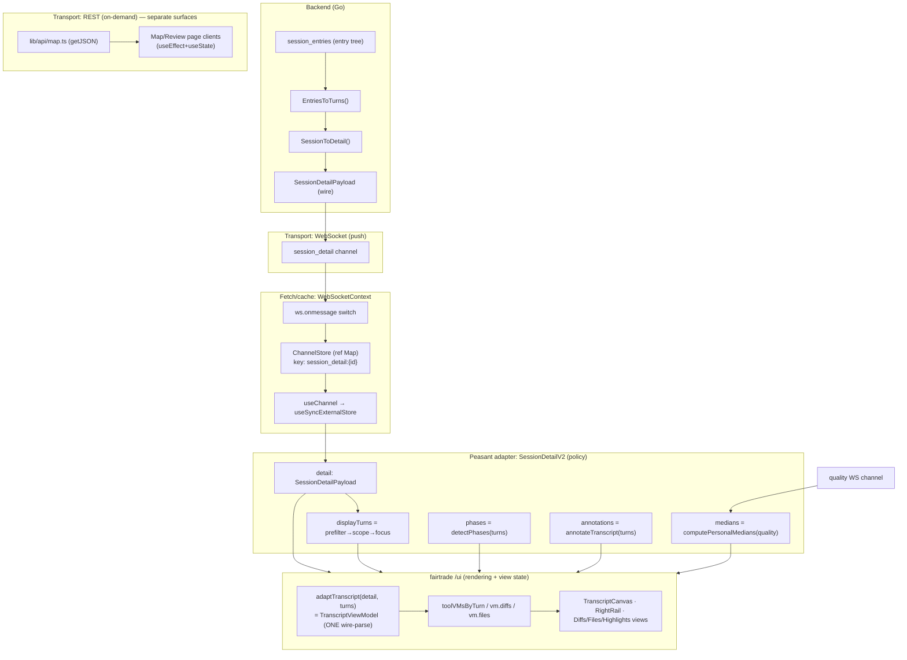
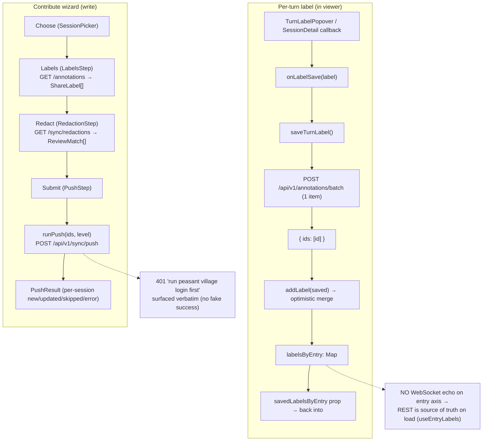

# Peasant Web — Data-Binding Architecture

How data flows from the Peasant backend to the rendered UI in **peasant-web**
(`web/`), and back again for mutations. This documents **what exists** and the
rationale behind the decisions, grounded in file:line references. It is not a
proposal.

Three repositories are involved:

- **peasant** — the Go backend + the Next.js dashboard under `web/`. Owns the
  *data layer* (transport, fetch, adapters, mutation wiring) and app-specific
  *policy* (scoping, routing, links).
- **fairtrade** — `@peasant-labs/fairtrade`, the design-system, the shared
  transcript viewer (`/ui`'s `<TranscriptViewer>` composite + helpers), the
  `/graph` trajectory-graph engine, and the one cooked transcript view-model
  adapter (`adaptTranscript`). Peasant consumes its published package directly
  for all transcript rendering and view state.

---

## 1. Overview

### The layers

Data reaches a rendered component through a layered pipeline. The two parameters
that vary per surface are **(a)** which transport delivers the raw wire payload
and **(b)** whether a cohesive view-model adapter or a small per-component
prop-adapter sits between the wire and the component.

```
                BACKEND (Go)                TRANSPORT            FETCH / CACHE             ADAPTER                  VIEW-MODEL / COMPONENT
  ───────────────────────────────────   ───────────────   ──────────────────────   ───────────────────────   ───────────────────────────
  session_entries
    → EntriesToTurns
    → SessionToDetail               ──▶  WebSocket          WebSocketContext         (cohesive)                fairtrade `/ui`
    → SessionDetailPayload               session_detail     ChannelStore +           adaptTranscript() →        <TranscriptViewer> → dumb
                                         (push)             useSyncExternalStore     TranscriptViewModel        canvas/rails/views
                                                                                     (the ONE wire-parse)

  sessions / dashboard /            ──▶  WebSocket          WebSocketContext         (distributed)             ProjectPicker, session
  quality / trends                       channels (push)    ChannelStore             rowsFrom*, mapBackend*,    lists, filter bars
                                                                                     toShareLabel, …

  Map / Review / search /           ──▶  REST (GET)         lib/api/*.ts             (distributed)             Map/Review page clients,
  project summaries / annotations        fetch()            useEffect+useState       small per-call mappers     Command palette
```

Two transports coexist by design:

- **WebSocket** for *ambient, push-driven liveness*: `dashboard`, `sessions`,
  `trends`, `quality`, `session_detail`, `annotations`. One persistent socket,
  multiplexed by channel, with a ref-based store so a `sessions` update never
  re-renders a `dashboard`-only consumer
  (`web/src/contexts/WebSocketContext.tsx:41`, `:362`).
- **REST** (`fetch`) for *parameterized, on-demand, expensive* surfaces:
  Map/Review graphs, project summaries, per-file diffs, full-text search, and
  the annotation read/write calls (`web/src/lib/api/map.ts:14`,
  `web/src/lib/api/annotations.ts:1`). There is **no React Query / SWR** — the
  REST pattern is hand-rolled `useEffect` + `useState` + a `cancelled` flag, with
  no client cache beyond component state (verified: nothing matching
  `react-query|tanstack|swr` in `web/package.json`).

### The transcript read path (the one cohesive adapter)

1. Backend folds the normalized entry tree into the canonical
   `SessionDetailPayload` (`store.ListEntries → api.EntriesToTurns →
   api.SessionToDetail`) and pushes it on the `session_detail` WS channel.
2. `WebSocketContext` writes it into the `ChannelStore` under both the bare key
   and the id-qualified key `session_detail:{id}`
   (`web/src/contexts/WebSocketContext.tsx:183`).
3. `SessionDetailV2` subscribes with `useChannel(subscribe.sessionDetail(id))`
   and gets the typed `detail`
   (`web/src/components/session-detail/v2/SessionDetailV2.tsx:75`).
4. `SessionDetailV2` (the *thin adapter*) derives host-owned inputs the package
   refuses to derive itself — the scoped/focused turn list, phase dividers,
   pattern annotations, scorecard medians — and hands them to the shared
   `<TranscriptViewer>` via props/callbacks (`:251`–`:328`).
5. Inside `<TranscriptViewer>`, **one** call to `adaptTranscript(detail, turns)`
   parses the wire (tool `arguments`/`result` JSON, git drift) exactly once into
   a cooked `TranscriptViewModel`; every dumb child renders cooked fields and
   never `JSON.parse`s. This composition is owned by the published
   `@peasant-labs/fairtrade` package's `/ui` entry.

### The write/mutation path

Peasant is **read-mostly over WebSocket; writes go over REST**. There are two
write paths, both POSTs, both surfacing the server's real result/error:

- **Per-turn label** (in the viewer): `onLabelSave` → `saveTurnLabel` →
  `POST /api/v1/annotations/batch` (single-item) → returned id is merged
  *optimistically* into a local map; **no WS echo** for the entry axis, so REST
  is the source of truth (`web/src/lib/api/annotations.ts:190`,
  `web/src/components/session-detail/v2/lib/useEntryLabels.ts:112`).
- **Contribute / share** (the wizard): a 4-step machine (Choose → Labels →
  Redact → Submit) whose final step calls `runPush` →
  `POST /api/v1/sync/push`, running the same pipeline as `peasant village push`
  (`web/src/lib/share/push.ts:37`). The Redact step previews real findings via
  `GET /api/v1/sync/redactions` (`web/src/lib/share/redactions.ts:58`).

There is **no optimistic-cache invalidation framework** (no query client). The
viewer's label save does a manual optimistic merge; the wizard simply renders the
push's returned per-session results.

---

## 2. Diagrams

### (a) READ data flow



### (b) WRITE / mutation flow



### (c) Adapter-boundary map

```mermaid
flowchart LR
  subgraph WIRE["Wire types (mirror Go structs)"]
    M["types/messages.ts\n(SessionDetailPayload, SessionSummary, TurnDetail…)"]
    MAPT["types/map.ts\n(Map/Review payloads)"]
    ANT["lib/api/annotations.ts wire types\n(AnnotationSummary, AnnotationType)"]
  end

  subgraph COHESIVE["ONE cohesive view-model adapter"]
    AT["fairtrade adaptTranscript()\nwire → TranscriptViewModel\n(sole wire-parse + git-drift normalize)"]
  end

  subgraph DIST["Distributed per-component prop-adapters"]
    SV["SessionDetailV2\n(scope/focus turns, phases, annotations,\nlinkBuilder, capabilities, callbacks)"]
    PI["MetadataChips (fairtrade /ui)\nharness → ProviderIcon + providerLabel chip"]
    RS["RedactionStep\nRedaction → ReviewMatch (confidence/100, ns id)"]
    LS["LabelsStep\nAnnotationSummary → ShareLabel"]
    UEL["useEntryLabels\nAnnotationSummary → SavedTurnLabel (entry only)"]
    SW["ShareWizardClient\nBackendSessionSummary → ShareSession"]
    PP["ProjectPicker\nProjectSummary | SessionSummary → PickerRow"]
  end

  M --> AT
  M --> SV
  M --> PI
  M --> SW
  M --> PP
  MAPT --> PP
  ANT --> RS
  ANT --> LS
  ANT --> UEL
  AT --> TBV["fairtrade /ui dumb components"]
```



---

## 3. Adapters

### 3.1 The cohesive view-model adapter — `adaptTranscript` (`SessionDetailV2` feeds it)

The transcript is the one surface with a single, cohesive wire→view-model
projection. The projection itself lives in **fairtrade**, invoked **once** inside
fairtrade's own `<TranscriptViewer>` composite; peasant's `SessionDetailV2` is
the host adapter that owns the *data* and *policy* around it.

**`adaptTranscript(payload, annotations?, analytics?) → TranscriptViewModel`**
(`web/node_modules/@peasant-labs/fairtrade/dist/lib/types/transcript/adapter.d.ts:31`;
invoked by fairtrade's own `/ui` `<TranscriptViewer>` composite).

- **Input:** `TranscriptWireInput` — the canonical `SessionDetailPayload`
  (folded turns; tool `arguments`/`result` carried as raw JSON strings; git
  context in either the Go-flat or the drifted TS shape).
- **Output:** `TranscriptViewModel` — cooked, render-ready fields:
  `vm.turns[].toolCalls` as `ToolCallVM[]` (parsed args/result, classified
  `ToolGroup`), `vm.diffs` (`DiffEntryVM[]` via an internal LCS `diffLines`),
  `vm.files` (`FileEntryVM[]`, unique paths), `vm.session` (`SessionVM` + cooked
  `SessionGitVM`/`CommitVM` chrome)
  (`web/node_modules/@peasant-labs/fairtrade/dist/lib/types/transcript/view-model.d.ts`).
- **Why it exists:** it is "the SOLE wire-parse + git-drift normalisation site"
  (adapter.d.ts:23). The composer parses once and threads cooked fields to every
  dumb child via `toolVMsByTurn` (`SessionDetail.tsx:222`), `vm.diffs`
  (`:706`), `vm.files`/`distinctFileCount` (`:257`, `:709`). This is the
  one-place-to-parse decision: many components, one parse, parallel-by-index with
  the wire turns.
- **Host call:** `SessionDetailV2` passes the filtered generated-schema payload
  directly to `adaptTranscript({ ...detail, turns: visibleTurns }, undefined,
  analytics)`; no parallel wire type or compatibility cast sits at this boundary.

**`SessionDetailV2` — the host adapter / policy layer**
(`web/src/components/session-detail/v2/SessionDetailV2.tsx`):

| Concern | Input | Output → package | file:line |
|---|---|---|---|
| Transport | `subscribe.sessionDetail(id)` WS | `detail` (`SessionDetailPayload`) | `:75` |
| Turn scoping | `detail.turns` + URL `?scope/scopeVal` + focus pref | `turns` prop (`displayTurns`) via `prefilterTurns → scopeTurns → focusedTurns` | `:141` |
| Phase dividers | the *displayed* turn list | `phases` prop (`detectPhases`) | `:163` |
| Pattern markers | the *displayed* turn list | `annotations` prop (`annotateTranscript`) | `:167` |
| Scorecard medians | `quality` WS channel | `medians` passed to `computeAnalytics` (`computePersonalMedians`) | `:112`, `:208` |
| Permalinks | live `searchParams` + `?turn=N` | `linkBuilder` / `sessionLinkBuilder` / `initialTurnIndex` | `:87`, `:277`, `:282` |
| Entry-label write | popover save | `capabilities`, `callbacks.onLabelSave`, `renderTurnActions`, `savedLabelsByEntry` | `:285`–`:327` |
| Touched-files panel | per-turn file touches + `workingDirectory` | `renderTurnPanel` slot | `:316` |

The hard rule visible in the code: phases and annotations are **positional over
the rendered list**, so they must be computed from the exact `displayTurns`
handed to the package, or dividers/markers land on wrong turns (`:159`–`:170`).
Scoping *policy* lives in this adapter; the rendering *seams* (`turns`,
`renderTurnPanel`, harness-derived provider) are package contract (`:48`–`:63`).

### 3.2 Distributed per-component prop-adapters (the heterogeneous chrome)

Outside the transcript, each surface has a small, local input→output mapper. No
shared view-model; the shapes are too unlike each other to share.

**Provider / harness → chip.** The harness wire value (`detail.harness`) is the
provider key. It is passed through untouched and rendered in the *shared*
`MetadataChips` header via fairtrade's own `ProviderIcon` + `providerLabel`
inside a `<Chip>`:
`const provider = detail.harness; <Chip><ProviderIcon harness={provider} accent/> {providerLabel(provider)}</Chip>`
(`@peasant-labs/fairtrade` `/ui` `MetadataChips` and provider helpers).
- **Surprising:** peasant *also* ships its **own** `ProviderIcon`
  (`web/src/components/ProviderIcon.tsx`) with a `Harness → text-provider-*`
  class map (`:28`), but a repo-wide grep finds **no usages** in app code — it
  appears to be dead/duplicate of the fairtrade one the live UI actually uses.
  (Flagging as an inconsistency, not asserting intent.)

**Redaction wire → review match** (`web/src/components/share/RedactionStep.tsx`).
- Input: flattened `Redaction[]` from `GET /sync/redactions`
  (`web/src/lib/share/redactions.ts:58`; the server returns
  category→rule→item, flattened client-side at `redactions.ts:69`).
- Output: fairtrade `RedactionReview` `ReviewMatch` — `confidence` rescaled
  `0–100 → 0–1`, `before/after` from original/replacement, and a
  **session-namespaced** `matchId(sessionId, redactionId)` so two sessions
  redacting the same secret on the same line stay unique in one flattened review
  surface (`RedactionStep.tsx:104`, `:165`).
- Why: every selected session's findings collapse into one safe-by-default review
  list; `kept` (opt-out) is local UI state (`:146`).

**Session annotation → share label** (`web/src/components/share/LabelsStep.tsx:50`).
- Input: `AnnotationSummary` from `GET /annotations`, filtered to
  `targetKind === 'session'` (`:110`).
- Output: `ShareLabel` distilled to push-bound fields; `annotatorKind` mapped to
  an `auto`/`manual` origin via `originForAnnotatorKind`
  (`web/src/lib/share/types.ts:112`). Only the **included** annotation ids flow
  into the push.

**Backend annotation → saved turn label** (`useEntryLabels.ts:26`).
- Input: `AnnotationSummary`; **only** entry-targeted ones (`targetKind ===
  'entry' && targetEntryIndex != null`) survive — session/project/meta dropped.
- Output: `SavedTurnLabel`, grouped into `Map<entryIndex, SavedTurnLabel[]>`
  (`:41`), then optimistically merged with locally-saved labels (`:100`).

**Backend summary → wizard session** (`ShareWizardClient.tsx:36`).
- Input: a trimmed `BackendSessionSummary` from `GET /api/v1/sessions`.
- Output: `ShareSession` (`:36`–`:52`). Note `harness` is mapped onto the
  wizard's `provider` field, and `projectHash`/`hostSlug`/`model` are filled with
  empty strings (the REST summary doesn't carry them yet — an honest stub, see
  `ShareSession` doc at `web/src/lib/share/types.ts:5`).

**Project/session lists → picker rows** (`web/src/components/picker/ProjectPicker.tsx`).
- Two input shapes, one output `PickerRow[]`:
  - `rowsFromSummaries(ProjectSummariesPayload)` — full stats from
    `GET /projects/summary` (`:50`).
  - `rowsFromSessions(SessionSummary[])` — fallback from the `sessions` WS
    channel while the summary REST is in flight or failed; coverage/open-changes
    become `null` → rendered as "—" (`:69`).
- Why two: the home page prefers the rich REST summary but degrades to the
  always-live WS channel so the picker is never blank (`web/src/app/page.tsx:230`).

---

## 4. Key decisions + rationale

**One cohesive view-model adapter for the transcript; distributed prop-adapters
for the chrome.** The transcript is a *single coherent artifact* with one wire
shape (`SessionDetailPayload`) feeding *many* sibling views (canvas, diffs,
files, highlights, rails, graph) that all need the *same* expensive derivations
(JSON-parsed tool args, LCS diffs, git-drift normalization). Parsing once into a
shared `TranscriptViewModel` and threading cooked fields by index is the
proportionate design — N consumers, 1 parse (`SessionDetail.tsx:216`–`228`). The
chrome is the opposite: heterogeneous surfaces (redaction, labels, session lists,
provider chip) with unlike wire shapes and unlike outputs. A unified view-model
there would be a premature abstraction; each gets a small, local, testable mapper
instead. This split is deliberate and called out in the adapter's own docstring.

**Transport split: WebSocket for liveness, REST for parameterized surfaces.**
Ambient, always-on data (`dashboard`/`sessions`/`quality`/`session_detail`)
rides one multiplexed socket with auto-reconnect + exponential backoff
(`WebSocketContext.tsx:217`). Expensive, parameterized, on-demand surfaces
(Map/Review graphs, per-file diffs, search, project summaries) are REST so they
aren't computed/pushed unless asked for (`lib/api/map.ts:13`). The rationale is
explicit in `map.ts`: "these surfaces are REST (parameterized, on-demand,
expensive) — the `sessions` WS channel keeps providing ambient liveness."

**Ref-based channel store, not React state, for WS fan-in.** `ChannelStore` is a
plain `Map` behind `useSyncExternalStore`, keyed per subscription, so a write to
one channel notifies only that channel's listeners — a `sessions` update does not
re-render a `dashboard`-only component (`WebSocketContext.tsx:34`–`73`,
`:362`–`:398`). The context value itself changes only on connect/error
(infrequent). This is a deliberate render-isolation decision.

**Where mutation wiring lives.** Writes are *not* centralized. Each write lives
next to the surface that triggers it:
- the viewer's label save in `lib/api/annotations.ts` (`saveTurnLabel`) wired
  through `SessionDetailV2`'s `callbacks.onLabelSave` and `useEntryLabels`'
  optimistic merge;
- the contribute push in `lib/share/push.ts` (`runPush`) wired through
  `ShareWizardClient` → `PushStep`.
There is no shared mutation/query client. The viewer compensates with a manual
optimistic merge because the `annotations` WS channel does **not** emit
entry-axis updates, so REST is the load-bearing source of truth on load
(`useEntryLabels.ts:55`–`58`).

**Honest failure over faked success (write path).** `runPush` surfaces the
server's verbatim error (e.g. the 401 "run 'peasant village login' first") rather
than simulating progress or a fake "shared" state — the file documents this as a
correction of a prior lying-to-the-user implementation (`push.ts:1`–`11`). The
redaction preview is likewise a *real* local scan (`GET /sync/redactions`), not
mock diffs (`redactions.ts:1`–`12`). This is a stated trust-spine decision.

**Safe-by-default redaction; opt-in contribution.** The wizard defaults to the
`maximum` redaction level and redacts everything flagged unless the user opts an
item out; selection starts empty and the commons is framed as public
(`ShareWizardClient.tsx:205`, `:176`; `push.ts:47`). Submit has no approval gate
because redaction is safe-by-default (`ShareWizardClient.tsx:126`).

**Non-obvious / surprising patterns:**
- **The "ProviderTag with harness wire-value" surface is the shared
  `MetadataChips`, not a peasant component** — and peasant's local
  `ProviderIcon` appears unused (above). The harness→provider mapping that the
  live UI uses is fairtrade's.
- **Visibility `shares[] → sharedWith` and GitHub user search do NOT exist in
  peasant-web** (verified by grep). These are *village* (the multi-user server)
  features; peasant's only sharing surface is the one-way Contribute push to the
  commons. If something expected per-user visibility/sharing here, that is the
  drift — peasant has redaction + push, not per-user visibility/sharing.
- **`SessionDetailV2` mounts its own `<Suspense>`** so `useSearchParams` survives
  Next 15 static export (`:64`–`:72`) — a transport-adjacent constraint, not a
  data concern, but it shapes where the adapter boundary sits.
- **Optimistic state can outlive a reload mismatch**: `useEntryLabels` merges
  optimistic labels and de-dupes against server ids, but until a refetch the
  optimistic entry has whatever id the POST returned; there's no background
  reconciliation beyond the merge (`useEntryLabels.ts:100`–`110`). Noted as a
  real, intentional simplicity, not a bug.
- **REST reads have no cache**: every Map/Review/summary fetch is a fresh
  `useEffect` with a `cancelled` guard and component-local state (e.g.
  `page.tsx:211`, `SingleProjectChanges` at `page.tsx:140`). Re-mounting refetches.

---

## 5. Appendix — key files

**Transport**
- `web/src/contexts/WebSocketContext.tsx` — single WS, `ChannelStore`,
  `useChannel`/`useSyncExternalStore`, reconnect/backoff.
- `web/src/types/messages.ts` — host message types aligned with
  `github.com/peasant-labs/schema` and `internal/api/messages.go`; `subscribe.*` factories, `subscriptionKey`,
  `SessionDetailPayload`, `SessionSummary`, `TurnDetail`, enums.
- `web/src/lib/api/base.ts` — `getApiBaseUrl()` (origin-derived REST base).

**Fetch / cache (REST)**
- `web/src/lib/api/map.ts` — Map/Review/summary/search REST client (`getJSON`).
- `web/src/lib/api/annotations.ts` — annotation types/read + `saveTurnLabel`
  (batch create).
- `web/src/lib/share/redactions.ts` — `GET /sync/redactions` preview.
- `web/src/lib/share/push.ts` — `runPush` → `POST /sync/push`.

**Cohesive transcript adapter**
- `web/src/components/session-detail/v2/SessionDetailV2.tsx` — host adapter
  (transport + scope/focus/links/labels policy).
- `@peasant-labs/fairtrade` `/ui` `<TranscriptViewer>` composite — the single
  `adaptTranscript(...)` call plus cooked-field threading.
- `@peasant-labs/fairtrade` `/ui` session-detail types —
  `SessionTab` enum + tab defs.
- `@peasant-labs/fairtrade` `dist/lib/types/transcript/{adapter,view-model}.d.ts`
  — `adaptTranscript`, `TranscriptViewModel` / `ToolCallVM` / `DiffEntryVM` /
  `FileEntryVM` / `SessionVM` shapes.
- `web/src/components/session-detail/v2/lib/useEntryLabels.ts` — per-turn label
  read + optimistic merge.
- `web/src/components/session-detail/v2/lib/scopeTurns.ts` — scope/focus/markdown
  helpers used by the adapter.

**Distributed chrome prop-adapters**
- fairtrade `/ui` `.../header/MetadataChips.tsx` + `.../lib/provider.ts` —
  harness → provider chip (the live provider tag).
- `web/src/components/ProviderIcon.tsx` — peasant's own (apparently unused)
  harness→glyph map.
- `web/src/components/share/RedactionStep.tsx` — `Redaction → ReviewMatch`.
- `web/src/components/share/LabelsStep.tsx` — `AnnotationSummary → ShareLabel`.
- `web/src/app/share/ShareWizardClient.tsx` — `BackendSessionSummary →
  ShareSession`; wizard state machine.
- `web/src/lib/share/types.ts` — `ShareSession`/`ShareLabel`/`LabelSelection`
  + `originForAnnotatorKind`.
- `web/src/components/picker/ProjectPicker.tsx` — `rowsFromSummaries` /
  `rowsFromSessions` → `PickerRow`.
- `web/src/app/page.tsx` — home picker: WS `sessions` + REST `projects/summary`
  with fallback.
- `web/src/lib/ft-ui.ts` — the typed fairtrade `/ui` barrel every chrome
  component imports from.

**Backend reference (for the wire contract)**
- `internal/api/store_adapter.go` (`EntriesToTurns`), `internal/api/websocket.go`
  (`SessionToDetail`), and the public schema module's `SessionDetailPayload`.
- WebSocket channels + Map/Review REST routes are tabulated in the repo
  `web`/testing docs (channel payload shapes; route → payload table).

---

### Accuracy notes / uncertainties
- The fairtrade `adaptTranscript` internals were read from the shipped `.d.ts`
  (JSDoc typedefs), not the `.ts` source — field names and the "one wire-parse"
  contract are from those declarations + fairtrade `/ui`'s own usage, which agree.
- "Peasant's `ProviderIcon` is unused" is from a repo-wide grep of `web/src`
  returning only self-references; it could still be referenced from a path not
  searched (none found). Stated as observed, not as certain intent.
- `targetEntryEndIndex` half-open semantics, batch-only entry targeting, and the
  "no WS echo on entry axis" claim are from the client code comments
  (`annotations.ts:73`, `useEntryLabels.ts:55`); not cross-checked against the Go
  handler here.
